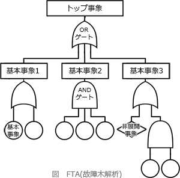

# [令和4年秋期 午前 問47](https://www.ap-siken.com/kakomon/04_aki/q47.html)

#問題 #テクノロジ #システム開発技術 #設計

解説を表示解説を隠す

<strong>問47</strong>　信頼性工学の視点で行うシステム設計において，発生し得る障害の原因を分析する手法であるFTAの説明はどれか。

<ul class="ap-choices">
<li class="ap-choice-item ap-wrong">

ア　システムの構成品目の故障モードに着目して，故障の推定原因を列挙し，システムへの影響を評価することによって，システムの信頼性を定性的に分析する。

これは<a href="用語/FMEA" class="internal-link" data-href="用語/FMEA">FMEA</a>(Failure Mode and Effects Analysis：<a href="用語/故障" class="internal-link" data-href="用語/故障">故障</a>モード影響解析)の説明です。ボトムアップ型の事象解析手法です。

</li>
<li class="ap-choice-item ap-correct">

イ　障害と，その中間的な原因から基本的な原因までの全ての原因とを列挙し，それらをゲート(論理を表す図記号)で関連付けた樹形図で表す。

正しい。樹形図を使って<a href="用語/障害" class="internal-link" data-href="用語/障害">障害</a>原因分析を行うのが<a href="用語/FTA" class="internal-link" data-href="用語/FTA">FTA</a>の特徴です。

</li>
<li class="ap-choice-item ap-wrong">

ウ　障害に関するデータを収集し，原因について"なぜなぜ分析"を行い，根本原因を明らかにする。

RCA(Root Cause Analysis)の説明です。問題や事象の<a href="用語/根本原因" class="internal-link" data-href="用語/根本原因">根本原因</a>を明らかにすることを目的として使用されます。

</li>
<li class="ap-choice-item ap-wrong">

エ　多角的で，互いに重ならないように定義したODC属性に従って障害を分類し，どの分類に障害が集中しているかを調べる。

ODC分析(Orthogonal Defect Classification Analysis：直交<a href="用語/欠陥" class="internal-link" data-href="用語/欠陥">欠陥</a>分類分析)の説明です。

</li>
</ul>

<h4>解説</h4>

<a href="用語/FTA" class="internal-link" data-href="用語/FTA">FTA</a>(Fault Tree Analysis：<a href="用語/故障" class="internal-link" data-href="用語/故障">故障</a>木解析)は、発生が好ましくない事象について、樹形図を用いて、発生経路、発生原因及び発生確率をトップダウン的に<a href="用語/展開" class="internal-link" data-href="用語/展開">展開</a>していくことで事象解析する手法です。上位事象と下位事象の関係を発生確率とゲートで表現することで、下位事象の発生確率の合計から最上位事象の発生確率を論理的に導くことができます。分析対象の事象（矩形枠)、基本事象（丸枠)、非<a href="用語/展開" class="internal-link" data-href="用語/展開">展開</a>事象（菱形枠)、通常事象（家型枠)、ORゲートやANDゲート（論理回路で使う記号と同じ)、移行（三角枠）などの図記号を使います。

