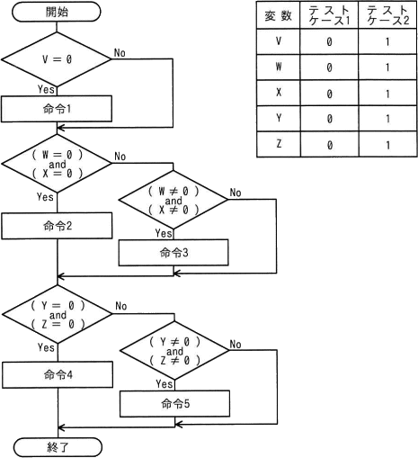
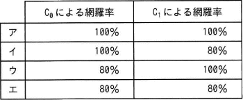
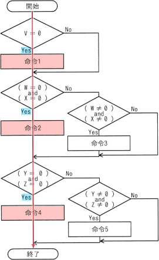
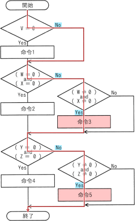

# [令和4年秋期 午前 問48](https://www.ap-siken.com/kakomon/04_aki/q48.html)

#問題 #テクノロジ #システム開発技術 #実装・構築

解説を表示解説を隠す

<strong>問48</strong>　流れ図で示したモジュールを表の二つのテストケースを用いてテストしたとき，テストカバレージ指標であるC0(命令網羅)とC1(分岐網羅)とによる網羅率の適切な組みはどれか。ここで，変数V～変数Zの値は，途中の命令で変更されない。  

<ul class="ap-choices">
<li class="ap-choice-item ap-wrong">

ア

<a href="用語/命令網羅" class="internal-link" data-href="用語/命令網羅">命令網羅</a>と分岐網羅の<a href="用語/網羅率" class="internal-link" data-href="用語/網羅率">網羅率</a>の組合せが誤っています。組合せは選択肢表を参照してください。

</li>
<li class="ap-choice-item ap-correct">

イ

正しい。2つの<a href="用語/テストケース" class="internal-link" data-href="用語/テストケース">テストケース</a>の合計で<a href="用語/命令網羅" class="internal-link" data-href="用語/命令網羅">命令網羅</a>は100%、分岐網羅は80%となります。

</li>
<li class="ap-choice-item ap-wrong">

ウ

<a href="用語/命令網羅" class="internal-link" data-href="用語/命令網羅">命令網羅</a>と分岐網羅の<a href="用語/網羅率" class="internal-link" data-href="用語/網羅率">網羅率</a>の組合せが誤っています。組合せは選択肢表を参照してください。

</li>
<li class="ap-choice-item ap-wrong">

エ

<a href="用語/命令網羅" class="internal-link" data-href="用語/命令網羅">命令網羅</a>と分岐網羅の<a href="用語/網羅率" class="internal-link" data-href="用語/網羅率">網羅率</a>の組合せが誤っています。組合せは選択肢表を参照してください。

</li>
</ul>

<h4>解説</h4>

最初にテストにおける網羅性のレベルである「<a href="用語/命令網羅" class="internal-link" data-href="用語/命令網羅">命令網羅</a>」と「分岐網羅」について確認しておきます。<a href="用語/命令網羅" class="internal-link" data-href="用語/命令網羅">命令網羅</a>：全ての命令を少なくとも1回は実行している。分岐網羅：判定条件の真偽を少なくとも1回は実行している。

<a href="用語/テストケース" class="internal-link" data-href="用語/テストケース">テストケース</a>1（全変数が0）を実行すると<a href="用語/流れ図" class="internal-link" data-href="用語/流れ図">流れ図</a>の以下のルートを通ります。

<a href="用語/テストケース" class="internal-link" data-href="用語/テストケース">テストケース</a>2（全変数が1）を実行すると<a href="用語/流れ図" class="internal-link" data-href="用語/流れ図">流れ図</a>の以下のルートを通ります。

2つのテストを合計すると、5つの命令はすべて実行しているので<a href="用語/命令網羅" class="internal-link" data-href="用語/命令網羅">命令網羅</a>の<a href="用語/網羅率" class="internal-link" data-href="用語/網羅率">網羅率</a>は100%、分岐先10つのうち8つを通っているので分岐網羅の<a href="用語/網羅率" class="internal-link" data-href="用語/網羅率">網羅率</a>は80%となります。したがって「イ」の組合せが適切です。

