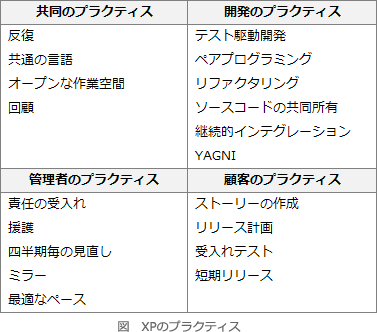

# [令和4年秋期 午前 問49](https://www.ap-siken.com/kakomon/04_aki/q49.html)

#問題 #テクノロジ #ソフトウェア開発管理技術 #開発プロセス・手法

解説を表示解説を隠す

<strong>問49</strong>　エクストリームプログラミング(XP：Extreme Programming)における"テスト駆動開発"の特徴はどれか。

<ul class="ap-choices">
<li class="ap-choice-item ap-wrong">

ア　最初のテストで，なるべく多くのバグを摘出する。

<a href="用語/テスト駆動開発" class="internal-link" data-href="用語/テスト駆動開発">テスト駆動開発</a>は最初のテストで多くのバグを摘出することを目的とする手法ではありません。

</li>
<li class="ap-choice-item ap-wrong">

イ　テストケースの改善を繰り返す。

<a href="用語/テストケース" class="internal-link" data-href="用語/テストケース">テストケース</a>の改善は開発の一環ですが、<a href="用語/テスト駆動開発" class="internal-link" data-href="用語/テスト駆動開発">テスト駆動開発</a>の定義となる特徴は「プログラムより先にテストを書く」ことです。

</li>
<li class="ap-choice-item ap-wrong">

ウ　テストでのカバレージを高めることを目的とする。

<a href="用語/カバレージ" class="internal-link" data-href="用語/カバレージ">カバレージ</a>を高めることは<a href="用語/テスト駆動開発" class="internal-link" data-href="用語/テスト駆動開発">テスト駆動開発</a>の主目的ではありません。

</li>
<li class="ap-choice-item ap-correct">

エ　プログラムを書く前にテストケースを記述する。

正しい。<a href="用語/テスト駆動開発" class="internal-link" data-href="用語/テスト駆動開発">テスト駆動開発</a>は、実装より先に<a href="用語/テストケース" class="internal-link" data-href="用語/テストケース">テストケース</a>を作成し、テストをパスする最小実装のあと<a href="用語/リファクタリング" class="internal-link" data-href="用語/リファクタリング">リファクタリング</a>で洗練する手法です。

</li>
</ul>

<h4>解説</h4>

エクストリームプログラミング(XP:Extreme Programming)は、1990年代後半、Kent Beck氏らによって提唱されたソフトウェア開発手法で、<a href="用語/アジャイル" class="internal-link" data-href="用語/アジャイル">アジャイル</a>ソフトウェア開発と称される一連の手法の先駆けとなったものです。『プログラマーは人間である』という思想のもと、叩き台となるプログラムを早期に開発し、短いサイクルで頻繁にテストとリリースを繰り返すことで、顧客の要求への対応力と生産性を高め、リスクを軽減することを目的としています。

<a href="用語/テスト駆動開発" class="internal-link" data-href="用語/テスト駆動開発">テスト駆動開発</a>(TDD：Test Driven Development)は、<a href="用語/XP" class="internal-link" data-href="用語/XP">XP</a>のプラクティスのひとつで、求める機能を明確化するためにプログラムを記述するよりも前に<a href="用語/テストケース" class="internal-link" data-href="用語/テストケース">テストケース</a>を作成する手法です。作成したテストをパスする最低限の実装を行った後で、機能を維持したまま（テストが通る状態のまま）コードを洗練していくという手順で開発を進めます。開発中にありがちな余分なコードの追加を防ぐ、素早く動くコードを作成できる、エラーを早期に発見できるなどの利点があるとされています。テストファーストプログラミングとも呼ばれます。

したがって「エ」が正解です。

