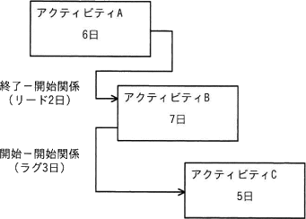
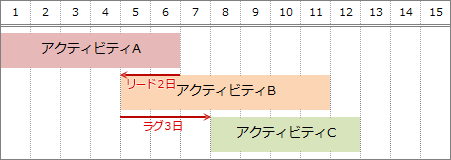

# [令和4年秋期 午前 問52](https://www.ap-siken.com/kakomon/04_aki/q52.html)

#問題 #マネジメント #プロジェクトマネジメント #プロジェクトの時間

解説を表示解説を隠す

<strong>問52</strong>　図は，実施する三つのアクティビティについて，プレシデンスダイアグラム法を用いて，依存関係及び必要な作業日数を示したものである。全ての作業を完了するための所要日数は最少で何日か。 

<ul class="ap-choices">
<li class="ap-choice-item ap-wrong">

ア　11

<a href="用語/リード" class="internal-link" data-href="用語/リード">リード</a>で前倒しできる分を過大に見積もり、各アクティビティの作業日数の合計を下回る誤答です。

</li>
<li class="ap-choice-item ap-correct">

イ　12

正しい。A→B（FS＋<a href="用語/リード" class="internal-link" data-href="用語/リード">リード</a>2日）とB→C（SS＋<a href="用語/ラグ" class="internal-link" data-href="用語/ラグ">ラグ</a>3日）を踏まえたスケジュールの最短完了日数は12日です。

</li>
<li class="ap-choice-item ap-wrong">

ウ　13

<a href="用語/リード" class="internal-link" data-href="用語/リード">リード</a>・<a href="用語/ラグ" class="internal-link" data-href="用語/ラグ">ラグ</a>を無視して直列に足し合わせた、または<a href="用語/ラグ" class="internal-link" data-href="用語/ラグ">ラグ</a>分を二重に加えた誤答です。

</li>
<li class="ap-choice-item ap-wrong">

エ　14

三アクティビティの作業日数を単純合計した誤答です（並行開始や<a href="用語/リード" class="internal-link" data-href="用語/リード">リード</a>を反映していません）。

</li>
</ul>

<h4>解説</h4>

プレシデンスダイアグラム法(<a href="用語/PDM" class="internal-link" data-href="用語/PDM">PDM</a>法)は、個々の作業を四角で囲み、作業同士を矢印で結ぶことで作業順序や依存関係を表現する図法です。

作業同士の関係を表すという意味では<a href="用語/アローダイアグラム" class="internal-link" data-href="用語/アローダイアグラム">アローダイアグラム</a>と同じですが、<a href="用語/アローダイアグラム" class="internal-link" data-href="用語/アローダイアグラム">アローダイアグラム</a>では作業を矢印で結合点を丸のノードで示すので、記述方法が根本的に異なります。また<a href="用語/アローダイアグラム" class="internal-link" data-href="用語/アローダイアグラム">アローダイアグラム</a>では、ある作業の終了が別の作業の開始条件となる「終了-開始」(FS：Finish to Start)の依存関係しか表現できませんが、プレシデンスダイアグラムでは「開始」と「終了」を組み合わせた4つの依存関係を記述することができます。

FF関係（Finish-to-Finish，終了-終了）「受付が終了したら試験会場への入場を終了する」というように、あるアクティビティの終了が、他方のアクティビティの終了条件になっている関係 FS関係（Finish-to-Start，終了-開始）「受付が終了してから試験を開始する」というように、あるアクティビティの終了が、他方のアクティビティの開始条件になっている関係 SF関係（Start-to-Finish，開始-終了）「試験が開始されたら受付を終了する」というように、あるアクティビティの開始が、他方のアクティビティの終了条件になっている関係 SS関係（Start-to-Start，開始-開始）「受付が開始されたら試験会場への入場を開始する」というように、あるアクティビティの開始が、他方のアクティビティの開始条件になっている関係

また「<a href="用語/リード" class="internal-link" data-href="用語/リード">リード</a>」と「<a href="用語/ラグ" class="internal-link" data-href="用語/ラグ">ラグ</a>」は、先行アクティビティに対して、後続アクティビティの開始を前倒しや後ろ倒しする制約がある場合にその時間を表すものです。 <a href="用語/リード" class="internal-link" data-href="用語/リード">リード</a>：先行アクティビティに対して、後続アクティビティの開始を前倒しできる時間 <a href="用語/ラグ" class="internal-link" data-href="用語/ラグ">ラグ</a>：先行アクティビティに対して、後続アクティビティの開始を遅らせる時間

以上を踏まえて、アクティビティ間の依存関係を整理すると次のことがわかります。

アクティビティAとアクティビティB ・「終了-開始」関係なので、アクティビティAが終了するとアクティビティBを開始できる。 ・<a href="用語/リード" class="internal-link" data-href="用語/リード">リード</a>2日なので、アクティビティBの開始は2日前倒しできる。 →アクティビティBは、アクティビティA終了日の2日前から開始できる

アクティビティBとアクティビティC ・「開始-開始」関係なので、アクティビティBが開始するとアクティビティCを開始できる。 ・<a href="用語/ラグ" class="internal-link" data-href="用語/ラグ">ラグ</a>3日なので、アクティビティCの開始は3日遅らせる。 →アクティビティCは、アクティビティB開始日の3日後から開始できる

このスケジュールを図で表すと、以下のように「12日」が最低所要日数となります。したがって「イ」が正解です。

