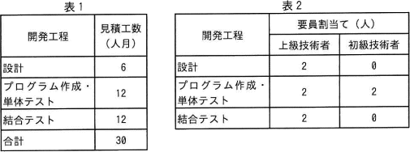

# [令和4年秋期 午前 問53](https://www.ap-siken.com/kakomon/04_aki/q53.html)

#問題 #マネジメント #プロジェクトマネジメント #プロジェクトの時間

解説を表示解説を隠す

<strong>問53</strong>　あるシステムの設計から結合テストまでの作業について，開発工程ごとの見積工数を表1に，開発工程ごとの上級技術者と初級技術者の要員割当てを表2に示す。上級技術者は，初級技術者に比べて，プログラム作成・単体テストにおいて2倍の生産性を有する。表1の見積工数は，上級技術者の生産性を基に算出している。 全ての開発工程に対して，上級技術者を1人追加して割り当てると，この作業に要する期間は何か月短縮できるか。ここで，開発工程の期間は重複させないものとし，要員全員が1カ月当たり1人月の工数を投入するものとする。 

<ul class="ap-choices">
<li class="ap-choice-item ap-wrong">

ア　1

追加前後の期間差を過小に見積もった誤答です（工程ごとの投入人数や初級技術者の換算を誤っている可能性があります）。

</li>
<li class="ap-choice-item ap-wrong">

イ　2

プログラム作成・単体テスト工程の<a href="用語/生産性" class="internal-link" data-href="用語/生産性">生産性</a>換算や、工程期間の合計を誤った誤答です。

</li>
<li class="ap-choice-item ap-wrong">

ウ　3

<a href="用語/要員" class="internal-link" data-href="用語/要員">要員</a>追加後の各工程期間の合計を誤った、または短縮月数の差分計算を誤った誤答です。

</li>
<li class="ap-choice-item ap-correct">

エ　4

正しい。追加前13か月、追加後9か月より、13－9＝4か月短縮できます。

</li>
</ul>

<h4>解説</h4>

追加<a href="用語/要員" class="internal-link" data-href="用語/要員">要員</a>を加える前と後で、工程ごとに作業完了に要する期間を求めて比較します。「表1の見積工数は，上級技術者の<a href="用語/生産性" class="internal-link" data-href="用語/生産性">生産性</a>を基にしている」及びプログラム作成・単体テスト工程において「上級技術者は、初級技術者の2倍の<a href="用語/生産性" class="internal-link" data-href="用語/生産性">生産性</a>である」という条件があるので、プログラム作成・単体テスト工程だけは初級技術者1人を0.5人として計算します。

[<a href="用語/要員" class="internal-link" data-href="用語/要員">要員</a>追加前] 設計 … 6人月÷2人＝3か月 プログラム作成・単体テスト … 12人月÷(2人＋(2人×0.5))＝12人月÷3人＝4か月 結合テスト … 12人月÷2人＝6か月 <a href="用語/要員" class="internal-link" data-href="用語/要員">要員</a>の追加前の開発期間は「3＋4＋6＝13か月」です。

[上級技術者1人追加後] 設計 … 6人月÷3人＝2か月 プログラム作成・単体テスト … 12人月÷(3人＋(2人×0.5))＝12人月÷4人＝3か月 結合テスト … 12人月÷3人＝4か月 <a href="用語/要員" class="internal-link" data-href="用語/要員">要員</a>の追加後の開発期間は「2＋3＋4＝9カ月」です。

よって、各工程に上級技術者を1人追加することで短縮できる期間は、13カ月－9カ月＝4カ月。したがって「エ」が正解です。

