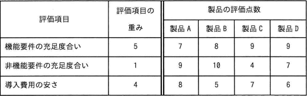

# [令和4年秋期 午前 問54](https://www.ap-siken.com/kakomon/04_aki/q54.html)

#問題 #マネジメント #プロジェクトマネジメント #プロジェクトの調達

解説を表示解説を隠す

<strong>問54</strong>　あるシステム導入プロジェクトで，調達候補のパッケージ製品を多基準意思決定分析の加重総和法を用いて評価する。製品A～製品Dのうち，総合評価が最も高い製品はどれか。ここで，評価点数の値が大きいほど，製品の評価は高い。 〔各製品の評価〕 

<ul class="ap-choices">
<li class="ap-choice-item ap-wrong">

ア　製品A

加重総和法で76点。製品C（77点）より低い誤答です。

</li>
<li class="ap-choice-item ap-wrong">

イ　製品B

加重総和法で70点。四製品のうち最も低い<a href="用語/総合評価" class="internal-link" data-href="用語/総合評価">総合評価</a>の誤答です。

</li>
<li class="ap-choice-item ap-correct">

ウ　製品C

正しい。加重総和法で77点となり、<a href="用語/総合評価" class="internal-link" data-href="用語/総合評価">総合評価</a>が最も高い製品です。

</li>
<li class="ap-choice-item ap-wrong">

エ　製品D

加重総和法で76点。製品Aと同点で、製品C（77点）より低い誤答です。

</li>
</ul>

<h4>解説</h4>

加重総和法は、評価項目ごとの点数に評価項目の重みを乗じた値の総和を求め、その多寡によって対象を評価する方法です。

項目Aの点数×項目Aの重み＋項目Bの点数×項目Bの重み＋…

設問では「評価点数の値が大きいほど，製品の評価は高い」とあるので、計算で求めた値が大きいほど<a href="用語/総合評価" class="internal-link" data-href="用語/総合評価">総合評価</a>も高いということになります。

製品A　7点×5＋9点×1＋8点×4＝76点 製品B　8点×5＋10点×1＋5点×4＝70点 製品C　9点×5＋4点×1＋7点×4＝77点 製品D　9点×5＋7点×1＋6点×4＝76点

したがって、<a href="用語/総合評価" class="internal-link" data-href="用語/総合評価">総合評価</a>が最も高い製品は「製品C」です。

