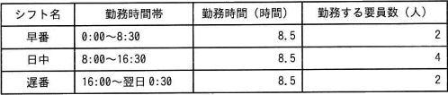

# [令和4年秋期 午前 問56](https://www.ap-siken.com/kakomon/04_aki/q56.html)

#問題 #マネジメント #サービスマネジメント #サービスの運用

解説を表示解説を隠す

<strong>問56</strong>　あるサービスデスクでは，年中無休でサービスを提供している。要員は勤務表及び勤務条件に従って1日3交替のシフト制で勤務している。1週間のサービス提供で必要な要員は，少なくとも何人か。  〔勤務表〕  〔勤務条件〕 ・勤務を交替するときに30分間で引継ぎを行う。 ・1回のシフト中に1時間の休憩を取り，労働時間は7.5時間とする。 ・1週間の労働時間は，40時間以内とする。

<ul class="ap-choices">
<li class="ap-choice-item ap-wrong">

ア　8

1日のシフト枠数（早番2・日中4・遅番2の計8）だけを<a href="用語/要員" class="internal-link" data-href="用語/要員">要員</a>数とみなした誤答です。1週間分の枠と労働時間上限は反映していません。

</li>
<li class="ap-choice-item ap-wrong">

イ　11

1週間56枠を1人あたり5枠で割った11.2を切り捨てた誤答です。<a href="用語/要員" class="internal-link" data-href="用語/要員">要員</a>数は不足分を補うため切り上げが必要です。

</li>
<li class="ap-choice-item ap-correct">

ウ　12

正しい。1週間56シフト枠を、1人あたり週40時間÷7.5時間＝5枠（切り捨て）で割り、56÷5＝11.2を切り上げて12人となります。

</li>
<li class="ap-choice-item ap-wrong">

エ　14

1人あたりの担当可能シフト数の上限（5枠）を過小評価するなど、割り算の前提を誤った誤答です。

</li>
</ul>

<h4>解説</h4>

1日の中に早番2つ、日中4つ、遅番2つで計8つのシフト枠があるので、1週間のシフト枠の合計は「8×7日＝56」です。1シフトにつき労働時間は7.5時間、1週間の労働時間は40時間以内なので、1人が1週間に担当できるシフト枠は、

40時間÷7.5時間＝5.333…

6つを担当すると計40時間を超えてしまうので、小数点以下を切り捨てた5シフトが上限となります。1週間のシフト枠の合計56を1人が担当できるシフト枠数で割ると、

56÷5＝11.2

小数部分を切り上げると、少なくとも12人の<a href="用語/要員" class="internal-link" data-href="用語/要員">要員</a>が必要であることがわかります。したがって「ウ」が正解です。

