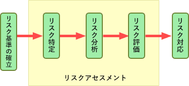

# [令和4年秋期 午前 問58](https://www.ap-siken.com/kakomon/04_aki/q58.html)

#問題 #マネジメント #システム監査

解説を表示解説を隠す

<strong>問58</strong>　JIS Q 27001:2014(情報セキュリティマネジメントシステム－要求事項)に基づいてISMS内部監査を行った結果として判明した状況のうち，監査人が指摘事項として監査報告書に記載すべきものはどれか。

<ul class="ap-choices">
<li class="ap-choice-item ap-wrong">

ア　USBメモリの使用を，定められた手順に従って許可していた。

資産の取扱いに関する手順は、組織が採用した情報分類体系に従って策定し、実施することとされているので問題ありません。

</li>
<li class="ap-choice-item ap-wrong">

イ　個人情報の誤廃棄事故を主務官庁などに，規定されたとおりに報告していた。

関係当局との適切な連絡体制を維持し、法が破られたと疑われる場合に、特定した<a href="用語/情報セキュリティインシデント" class="internal-link" data-href="用語/情報セキュリティインシデント">情報セキュリティインシデント</a>をいかにして時機を失せずに報告するかの手順を備えることとされているので問題ありません。

</li>
<li class="ap-choice-item ap-wrong">

ウ　マルウェアスキャンでスパイウェアが検知され，駆除されていた。

組織は、<a href="用語/不適合" class="internal-link" data-href="用語/不適合">不適合</a>が発生した場合、<a href="用語/不適合" class="internal-link" data-href="用語/不適合">不適合</a>の是正のための処置を取ることとされているので問題ありません。

</li>
<li class="ap-choice-item ap-correct">

エ　リスクアセスメントを実施した後に，リスク受容基準を決めた。

正しい。リスク受容基準の決定時期が遅いので<a href="用語/指摘事項" class="internal-link" data-href="用語/指摘事項">指摘事項</a>に該当します。

</li>
</ul>

<h4>解説</h4>

<a href="用語/JIS Q 27001" class="internal-link" data-href="用語/JIS Q 27001">JIS Q 27001</a>に基づく<a href="用語/リスクマネジメント" class="internal-link" data-href="用語/リスクマネジメント">リスクマネジメント</a>プロセスでは、リスクアセスメントを実施する前にリスク受容基準を確立することになっています。リスクアセスメントに含まれるリスク評価プロセスにおいて、リスク分析の結果とリスク受容基準を比較することになっているからです。 

