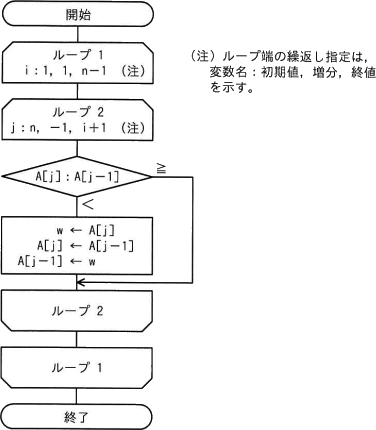
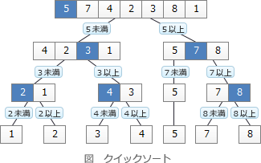
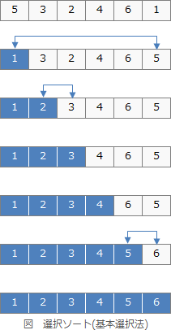
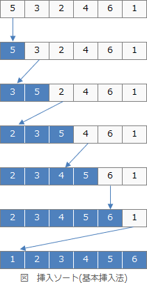
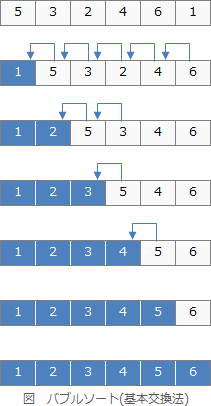

# [令和4年秋期 午前 問6](https://www.ap-siken.com/kakomon/04_aki/q6.html)

#問題 #テクノロジ #アルゴリズムとプログラミング #アルゴリズム

解説を表示解説を隠す

<strong>問6</strong>　未整列の配列 A[i](i=1，2，…，n)を，次の流れ図によって整列する。ここで用いられる整列アルゴリズムはどれか。 

<ul class="ap-choices">
<li class="ap-choice-item ap-wrong">

ア　クイックソート

<a href="用語/クイックソート" class="internal-link" data-href="用語/クイックソート">クイックソート</a>の説明です。データ群をある基準値を境に2つのグループに分割し、さらにそれぞれのグループで基準値を選んで2つのグループに分割するという処理を繰り返してデータを整列する<a href="用語/アルゴリズム" class="internal-link" data-href="用語/アルゴリズム">アルゴリズム</a>です。

</li>
<li class="ap-choice-item ap-wrong">

イ　選択ソート

<a href="用語/選択ソート" class="internal-link" data-href="用語/選択ソート">選択ソート</a>(基本選択法)の説明です。<a href="用語/配列" class="internal-link" data-href="用語/配列">配列</a>中の未整列の要素の中から最小値(最小値)を探し、未整列部分の先頭要素と交換することを繰り返して整列する<a href="用語/アルゴリズム" class="internal-link" data-href="用語/アルゴリズム">アルゴリズム</a>です。

</li>
<li class="ap-choice-item ap-wrong">

ウ　挿入ソート

<a href="用語/挿入ソート" class="internal-link" data-href="用語/挿入ソート">挿入ソート</a>(基本挿入法)の説明です。<a href="用語/配列" class="internal-link" data-href="用語/配列">配列</a>中の未整列の要素から一つずつ取り出し、整列済部分の適切な位置に挿入することを繰り返して整列する<a href="用語/アルゴリズム" class="internal-link" data-href="用語/アルゴリズム">アルゴリズム</a>です。

</li>
<li class="ap-choice-item ap-correct">

エ　バブルソート

正しい。<a href="用語/バブルソート" class="internal-link" data-href="用語/バブルソート">バブルソート</a>(基本交換法)は、<a href="用語/配列" class="internal-link" data-href="用語/配列">配列</a>中の隣り合った要素同士を比較し、順序が合っていなれば交換することを繰り返して整列する<a href="用語/アルゴリズム" class="internal-link" data-href="用語/アルゴリズム">アルゴリズム</a>です。

</li>
</ul>

<h4>解説</h4>

設問の<a href="用語/流れ図" class="internal-link" data-href="用語/流れ図">流れ図</a>における以下の処理に注目します。 w ← A[j] A[j] ← A[j-1] A[j-1] ← w この部分は、変数wを介して<a href="用語/配列" class="internal-link" data-href="用語/配列">配列</a>中の隣り合った要素の値を交換する処理を行っています。選択肢の整列<a href="用語/アルゴリズム" class="internal-link" data-href="用語/アルゴリズム">アルゴリズム</a>の中で隣り合った要素を比較し、交換しながら整列するのは<a href="用語/バブルソート" class="internal-link" data-href="用語/バブルソート">バブルソート</a>（基本交換法）のみなので「エ」が正解となります。

<a href="用語/クイックソート" class="internal-link" data-href="用語/クイックソート">クイックソート</a>は、データ群をある基準値を境に2つのグループに分割し、さらにそれぞれのグループで基準値を選んで2つのグループに分割するという処理を繰り返してデータを整列する<a href="用語/アルゴリズム" class="internal-link" data-href="用語/アルゴリズム">アルゴリズム</a>です。 

<a href="用語/選択ソート" class="internal-link" data-href="用語/選択ソート">選択ソート</a>(基本選択法)は、<a href="用語/配列" class="internal-link" data-href="用語/配列">配列</a>中の未整列の要素の中から最小値(最小値)を探し、未整列部分の先頭要素と交換することを繰り返して整列する<a href="用語/アルゴリズム" class="internal-link" data-href="用語/アルゴリズム">アルゴリズム</a>です。 

<a href="用語/挿入ソート" class="internal-link" data-href="用語/挿入ソート">挿入ソート</a>(基本挿入法)は、<a href="用語/配列" class="internal-link" data-href="用語/配列">配列</a>中の未整列の要素から一つずつ取り出し、整列済部分の適切な位置に挿入することを繰り返して整列する<a href="用語/アルゴリズム" class="internal-link" data-href="用語/アルゴリズム">アルゴリズム</a>です。 

正しい。<a href="用語/バブルソート" class="internal-link" data-href="用語/バブルソート">バブルソート</a>(基本交換法)は、<a href="用語/配列" class="internal-link" data-href="用語/配列">配列</a>中の隣り合った要素同士を比較し、順序が合っていなれば交換することを繰り返して整列する<a href="用語/アルゴリズム" class="internal-link" data-href="用語/アルゴリズム">アルゴリズム</a>です。 

