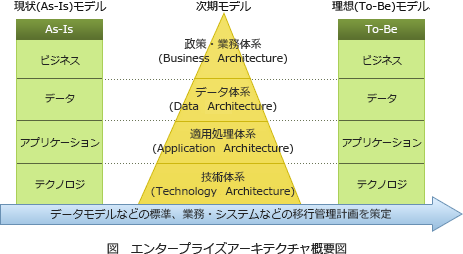

# [令和4年秋期 午前 問63](https://www.ap-siken.com/kakomon/04_aki/q63.html)

#問題 #ストラテジ #システム戦略 #情報システム戦略

解説を表示解説を隠す

<strong>問63</strong>　エンタープライズアーキテクチャ(EA)を説明したものはどれか。

<ul class="ap-choices">
<li class="ap-choice-item ap-wrong">

ア　オブジェクト指向設計を支援する様々な手法を統一して標準化したものであり，クラス図などの構造図と，ユースケース図などの振る舞い図によって，システムの分析や設計を行うものである。

これは<a href="用語/UML" class="internal-link" data-href="用語/UML">UML</a>(Unified Modeling Language)の説明です。

</li>
<li class="ap-choice-item ap-wrong">

イ　概念データモデルを，エンティティとリレーションシップとで表現することによって，データ構造やデータ項目間の関係を明らかにするものである。

これは<a href="用語/E-R図" class="internal-link" data-href="用語/E-R図">E-R図</a>の説明です。

</li>
<li class="ap-choice-item ap-correct">

ウ　各業務と情報システムを，ビジネスアーキテクチャ，データアーキテクチャ，アプリケーションアーキテクチャ，テクノロジアーキテクチャの四つの体系で分析し，全体最適化の観点から見直すものである。

正しい。エンタープライズアーキテクチャの説明です。

</li>
<li class="ap-choice-item ap-wrong">

エ　企業のビジネスプロセスを，データフロー，プロセス，ファイル，データ源泉／データ吸収の四つの基本要素で抽象化して表現するものである。

これは<a href="用語/DFD" class="internal-link" data-href="用語/DFD">DFD</a>(Data Flow Diagram)の説明です。

</li>
</ul>

<h4>解説</h4>

エンタープライズアーキテクチャ(Enterprise Architecture、以下EAと言う)は、社会環境や情報技術の変化に素早く対応できるよう、「全体最適」の観点から業務とシステム全体を改革するための<a href="用語/フレームワーク" class="internal-link" data-href="用語/フレームワーク">フレームワーク</a>です。主に大企業や政府、地方公共団体といった巨大な組織（enterprise）の業務手順と情報システムの標準化、組織の最適化を図るための方法論として活用されます。

EAにおける業務・システム最適化計画は、モデリングにより業務とシステムの現状（As-Is）とあるべき姿（To-Be）を整理し、あるべき姿（To-Be）の実現を目指して業務とシステムの改善を進める、というのが基本的な流れです。

EAを構成する4つの体系は次のとおりです。

ビジネス・アーキテクチャ（政策・業務体系）…政策・業務の内容、実施主体、<a href="用語/業務フロー" class="internal-link" data-href="用語/業務フロー">業務フロー</a>等について、共通化・合理化など実現すべき姿を体系的に示したもの。構成要素：<a href="用語/業務説明書" class="internal-link" data-href="用語/業務説明書">業務説明書</a>、機能構成図、機能情報関連図、<a href="用語/業務フロー" class="internal-link" data-href="用語/業務フロー">業務フロー</a>など

データ・アーキテクチャ（データ体系）…各業務・システムにおいて利用される情報すなわちシステム上のデータの内容、各情報（データ）間の関連性を体系的に示したもの。構成要素：情報体系クラス図、<a href="用語/エンティティ" class="internal-link" data-href="用語/エンティティ">エンティティ</a>・リレーション図、<a href="用語/データ定義表" class="internal-link" data-href="用語/データ定義表">データ定義表</a>など

アプリケーション・アーキテクチャ（処理体系）…業務処理に最適な情報システムの形態を体系的に示したもの。構成要素：<a href="用語/情報システム関連図" class="internal-link" data-href="用語/情報システム関連図">情報システム関連図</a>や<a href="用語/情報システム機能構成図" class="internal-link" data-href="用語/情報システム機能構成図">情報システム機能構成図</a>など

テクノロジ・アーキテクチャ（技術体系）…実際にシステムを構築する際に利用する諸々の技術的構成要素（ハード・ソフト・ネットワーク等）を体系的に示したもの。構成要素：<a href="用語/ネットワーク構成図" class="internal-link" data-href="用語/ネットワーク構成図">ネットワーク構成図</a>、<a href="用語/ソフトウェア構成図" class="internal-link" data-href="用語/ソフトウェア構成図">ソフトウェア構成図</a>、<a href="用語/ハードウェア構成図" class="internal-link" data-href="用語/ハードウェア構成図">ハードウェア構成図</a>など

