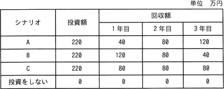

# [令和4年秋期 午前 問64](https://www.ap-siken.com/kakomon/04_aki/q64.html)

#問題 #ストラテジ #システム戦略 #情報システム戦略

解説を表示解説を隠す

<strong>問64</strong>　投資効果を正味現在価値法で評価するとき，最も投資効果が大きい(又は損失が小さい)シナリオはどれか。ここで，期間は3年間，割引率は5%とし，各シナリオのキャッシュフローは表のとおりとする。 

<ul class="ap-choices">
<li class="ap-choice-item ap-wrong">

ア　A

回収額の合計は他シナリオと同じだが、1年目が少なく最終年が多いため、割引の影響で現在価値の合計は最も低くなる。

</li>
<li class="ap-choice-item ap-correct">

イ　B

正しい。1年目の回収が多く現在価値の合計が最も高く、投資額220万円も上回る。

</li>
<li class="ap-choice-item ap-wrong">

ウ　C

3年間に回収が平準化されており、Aより現在価値は高いがBよりは低い。

</li>
<li class="ap-choice-item ap-wrong">

エ　投資をしない

シナリオBの現在価値は投資額を上回るため、投資しないよりBの方が有利。

</li>
</ul>

<h4>解説</h4>

正味現在価値法(<a href="用語/NPV法" class="internal-link" data-href="用語/NPV法">NPV法</a>)は、将来投資対象から得られる<a href="用語/収益" class="internal-link" data-href="用語/収益">収益</a>の現在価値と投資額の現在価値を比較して、投資判断を行う手法です。

"今もらえる100万円"と"50年後にもらえる100万円"だったら、今100万円もらいたいと感じるように、同じ額であっても受け取れるのが未来であるほどその価値は低くなります。現在価値は、この考え方を金銭の評価に応用したもので、将来得られる金額や利益を時間経過に応じた割引率で除することで、現時点における価値に置き換えて評価したものです。例えば割引率5％とすると、1年後に受け取る100万円は「100万円÷1.05」、2年後に受け取る100万円は「100万円÷1.052」、n年後に受け取る100万円は「100万円÷1.05n」という具合に価値を割り引いて現在価値に換算します。これにより、同じ額でも将来に受け取るほどその価値が低く見積もられることとなります。

本来でしたらシナリオごとに具体的な計算を行うのですが、電卓がないとこの計算はなかなか骨の折れる作業です。そこで、設問では各シナリオの回収額の合計が同じになっていることに着目します。上記の理屈を踏まえると、回収合計額が同じならばより早く大きな金額を受け取れる方が現在価値の合計は高くなるはずなので、3つのシナリオの回収時期を見て現在価値が高くなる順に並べると、1年目の割合が高いB、3年間に平準化されているC、最終年の割合が多いAの順になります。

最後に、シナリオBの現在価値が投資額を上回っているかどうかについても検討しなければなりません。「現在価値＜投資額」ならば、投資価値がないと判断されるからです。シナリオBの現在価値は、 120÷1.05＋80÷1.052＋40÷1.053 ≒120÷1.05＋80÷1.1＋40÷1.15 ≒114.2＋72.7＋34.7 ＝221.6万円 少額ではありますが投資額の220万円を上回るので、"投資をしない"場合よりもシナリオBの方が有利と判断されます。以上より、最も<a href="用語/投資効果" class="internal-link" data-href="用語/投資効果">投資効果</a>が大きいシナリオは「B」とわかります。

