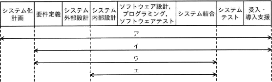
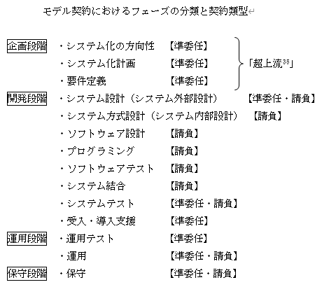

# [令和4年秋期 午前 問66](https://www.ap-siken.com/kakomon/04_aki/q66.html)

#問題 #ストラテジ #システム企画 #調達計画・実施

解説を表示解説を隠す

<strong>問66</strong>　"情報システム・モデル取引・契約書＜第二版＞"によれば，ウォーターフォールモデルによるシステム開発において，ユーザー(取得者)とベンダー(供給者)間で請負型の契約が適切であるとされるフェーズはどれか。 

<ul class="ap-choices">
<li class="ap-choice-item ap-wrong">

ア　システム化計画フェーズから導入・受入支援フェーズまで

システム化計画フェーズを含むため、請負型が適切とされる範囲より広い。

</li>
<li class="ap-choice-item ap-wrong">

イ　要件定義フェーズから導入・受入支援フェーズまで

要件定義フェーズから導入・受入支援まで含むため、請負型が適切とされる範囲より広い。

</li>
<li class="ap-choice-item ap-wrong">

ウ　要件定義フェーズからシステム結合フェーズまで

要件定義フェーズを含むため、請負型が適切とされるシステム内部設計～システム結合の範囲と一致しない。

</li>
<li class="ap-choice-item ap-correct">

エ　システム内部設計フェーズからシステム結合フェーズまで

正しい。<a href="用語/情報システム・モデル取引・契約書" class="internal-link" data-href="用語/情報システム・モデル取引・契約書">情報システム・モデル取引・契約書</a>では、請負型が適切とされるフェーズはシステム方式設計(システム内部設計)～システム結合である。

</li>
</ul>

<h4>解説</h4>

<a href="用語/情報システム・モデル取引・契約書" class="internal-link" data-href="用語/情報システム・モデル取引・契約書">情報システム・モデル取引・契約書</a>は、ユーザーとベンダーのあるべき理想的なモデルを提示し、情報システムのライフサイクルプロセスの中で、『ユーザーとベンダーの間でどのようなことを決定し、どのようなことを情報共有すればよいか』についての統一的な指針を目指して策定されたガイドラインです。

このガイドラインでは一括<a href="用語/請負契約" class="internal-link" data-href="用語/請負契約">請負契約</a>方式ではなく、工程ごとに見積り・<a href="用語/請負契約" class="internal-link" data-href="用語/請負契約">請負契約</a>を行う「多段階契約」という方式を推奨しています。<a href="用語/情報システム・モデル取引・契約書" class="internal-link" data-href="用語/情報システム・モデル取引・契約書">情報システム・モデル取引・契約書</a>では、フェーズの分類と対応する契約類型を以下のように規定しています。

上記のうち「請負型」の契約が適切とされているフェーズは、システム方式設計(システム内部設計)～システム結合です。したがって「エ」が適切です。

