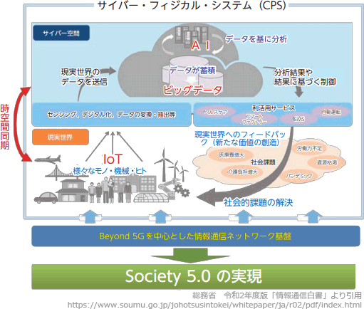

# [令和4年秋期 午前 問73](https://www.ap-siken.com/kakomon/04_aki/q73.html)

#問題 #ストラテジ #ビジネスインダストリ #ビジネスシステム

解説を表示解説を隠す

<strong>問73</strong>　サイバーフィジカルシステム(CPS)の説明として，適切なものはどれか。

<ul class="ap-choices">
<li class="ap-choice-item ap-wrong">

ア　1台のサーバ上で，複数のOSを動かし，複数のサーバとして運用する仕組み

サーバ仮想化の説明です。

</li>
<li class="ap-choice-item ap-wrong">

イ　仮想世界を現実かのように体感させる技術であり，人間の複数の感覚を同時に刺激することによって，仮想世界への没入感を与える技術のこと

XR(クロスリアリティ)の説明です。

</li>
<li class="ap-choice-item ap-correct">

ウ　現実世界のデータを収集し，仮想世界で分析・加工して，現実世界側にリアルタイムにフィードバックすることによって，付加価値を創造する仕組み

正しい。<a href="用語/サイバーフィジカルシステム" class="internal-link" data-href="用語/サイバーフィジカルシステム">サイバーフィジカルシステム</a>の説明です。

</li>
<li class="ap-choice-item ap-wrong">

エ　電子データだけでやり取りされる通貨であり，法定通貨のように国家による強制通用力をもたず，主にインターネット上での取引などに用いられるもの

<a href="用語/暗号資産" class="internal-link" data-href="用語/暗号資産">暗号資産</a>の説明です。

</li>
</ul>

<h4>解説</h4>

<a href="用語/サイバーフィジカルシステム" class="internal-link" data-href="用語/サイバーフィジカルシステム">サイバーフィジカルシステム</a>は、サイバー空間(仮想空間)とフィジカル空間(現実空間)を高度に融合させたシステムです。フィジカル空間をセンサーで捉えた情報をサイバー空間に集積し、サイバー空間に配置されたAI等で処理された結果をフィジカル空間にフィードバックすることにより、これまでにはできなかった新たな価値を産業や社会にもたらすことが期待されています。日本政府が目指す<a href="用語/Society5.0" class="internal-link" data-href="用語/Society5.0">Society5.0</a>を実現するための基幹技術です。

