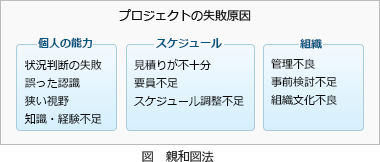

# [令和4年秋期 午前 問76](https://www.ap-siken.com/kakomon/04_aki/q76.html)

#問題 #ストラテジ #企業活動 #業務分析・データ利活用

解説を表示解説を隠す

<strong>問76</strong>　引き出された多くの事実やアイディアを，類似するものでグルーピングしていく収束技法はどれか。

<ul class="ap-choices">
<li class="ap-choice-item ap-wrong">

ア　NM法

NM法は、類比思考法によるアイディア発想法で、①課題を決める、②キーワードを決める、③類比を発想する、④アナロジーの背景を探る、⑤テーマと背景を結び付けてアイデアを出す、⑥解決案にまとめる、という手順で行うものです。名称の由来は、この技法を考案した中山正和氏のイニシャルです。

</li>
<li class="ap-choice-item ap-wrong">

イ　ゴードン法

ゴードン法は、<a href="用語/ブレーンストーミング" class="internal-link" data-href="用語/ブレーンストーミング">ブレーンストーミング</a>と同じく多様なアイディアを発想するためのグループ討議法です。異なるのは議論の本来のテーマを知っているのが司会者だけという点です。参加者にはテーマよりも抽象的な課題について自由に討論してもらうことで視野を広げ、固定観念にとらわれない柔軟な発想を生まれやすくしています。

</li>
<li class="ap-choice-item ap-correct">

ウ　親和図法

正しい。<a href="用語/親和図法" class="internal-link" data-href="用語/親和図法">親和図法</a>(KJ法)は、あるテーマに基づいて集めたデータを相互の関連によってグループ化することで、項目を整理する手法です。複雑に絡み合った問題やまとまっていない意見、出されたアイディアなどを整理したりまとめたりするために用いられます。

</li>
<li class="ap-choice-item ap-wrong">

エ　ブレーンストーミング

<a href="用語/ブレーンストーミング" class="internal-link" data-href="用語/ブレーンストーミング">ブレーンストーミング</a>は、多様なアイディアを幅広く集めるために、批判禁止・自由奔放・質より量・便乗歓迎というルールで行うグループ討議の手法です。

</li>
</ul>

<h4>解説</h4>

<a href="用語/親和図法" class="internal-link" data-href="用語/親和図法">親和図法</a>(KJ法)は、あるテーマに基づいて集めたデータを相互の関連によってグループ化することで、項目を整理する収束技法です。複雑に絡み合った問題やまとまっていない意見、出されたアイディアなどを整理したりまとめたりするために用いられます。

正しい。<a href="用語/親和図法" class="internal-link" data-href="用語/親和図法">親和図法</a>(KJ法)は、あるテーマに基づいて集めたデータを相互の関連によってグループ化することで、項目を整理する手法です。複雑に絡み合った問題やまとまっていない意見、出されたアイディアなどを整理したりまとめたりするために用いられます。 

