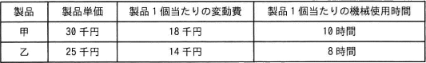

# [令和4年秋期 午前 問77](https://www.ap-siken.com/kakomon/04_aki/q77.html)

#問題 #ストラテジ #企業活動 #会計・財務

解説を表示解説を隠す

<strong>問77</strong>　表の製品甲と乙とを製造販売するとき，年間の最大営業利益は何千円か。ここで，甲と乙の製造には同一の機械が必要であり，機械の年間使用可能時間は延べ10,000時間，年間の固定費総額は10,000千円とする。また，甲と乙の製造に関して，機械の使用時間以外の制約条件はないものとする。 

<ul class="ap-choices">
<li class="ap-choice-item ap-wrong">

ア　2,000

単位時間当たりの粗利益を比較し乙を優先した場合の営業利益は3,750千円です。

</li>
<li class="ap-choice-item ap-correct">

イ　3,750

正しい。乙1,250個<a href="用語/販売" class="internal-link" data-href="用語/販売">販売</a>時の粗利益13,750千円から固定費10,000千円を差し引くと3,750千円です。

</li>
<li class="ap-choice-item ap-wrong">

ウ　4,750

製品構成や<a href="用語/販売" class="internal-link" data-href="用語/販売">販売</a>個数の計算が誤っています。

</li>
<li class="ap-choice-item ap-wrong">

エ　6,150

製品構成や<a href="用語/販売" class="internal-link" data-href="用語/販売">販売</a>個数の計算が誤っています。

</li>
</ul>

<h4>解説</h4>

単位時間当たりの粗利益で製品甲と乙を比べると、甲 … (30千円－18千円)÷10時間＝1.2千円、乙 … (25千円－14千円)÷8時間＝1.375千円ですから、特に制約がなければ、乙を優先的に<a href="用語/製造" class="internal-link" data-href="用語/製造">製造</a><a href="用語/販売" class="internal-link" data-href="用語/販売">販売</a>したほうが効率よく利益を上げられることになります。

10,000時間で<a href="用語/製造" class="internal-link" data-href="用語/製造">製造</a>できる乙の個数は、10,000時間÷8時間＝1,250個。乙を1,250個<a href="用語/販売" class="internal-link" data-href="用語/販売">販売</a>したときの利益は、(25千円－14千円)×1,250個＝13,750千円。粗利益から固定費を差し引いた額が営業利益となります。13,750千円－10,000千円＝3,750千円。したがって「イ」が正解です。

