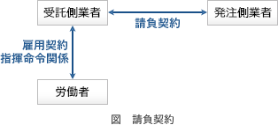

# [令和4年秋期 午前 問79](https://www.ap-siken.com/kakomon/04_aki/q79.html)

#問題 #ストラテジ #法務 #労働関連・取引関連法規

解説を表示解説を隠す

<strong>問79</strong>　発注者と受注者の間でソフトウェア開発における請負契約を締結した。ただし，発注者の事業所で作業を実施することになっている。この場合，指揮命令権と雇用契約に関して，適切なものはどれか。

<ul class="ap-choices">
<li class="ap-choice-item ap-wrong">

ア　指揮命令権は発注者にあり，さらに，発注者の事業所での作業を実施可能にするために，受注者に所属する作業者は，新たな雇用契約を発注者と結ぶ。

<a href="用語/指揮命令" class="internal-link" data-href="用語/指揮命令">指揮命令</a>権は発注者にある、作業者は発注者と新たな<a href="用語/雇用契約" class="internal-link" data-href="用語/雇用契約">雇用契約</a>を結ぶという2点が誤りです。

</li>
<li class="ap-choice-item ap-wrong">

イ　指揮命令権は発注者にあり，受注者に所属する作業者は，新たな雇用契約を発注者と結ぶことなく，発注者の事業所で作業を実施する。

<a href="用語/指揮命令" class="internal-link" data-href="用語/指揮命令">指揮命令</a>権は受注者にあるので誤りです。<a href="用語/請負契約" class="internal-link" data-href="用語/請負契約">請負契約</a>であるにもかかわらず、受注者の従業員に対して発注者が<a href="用語/指揮命令" class="internal-link" data-href="用語/指揮命令">指揮命令</a>を行っていると<a href="用語/偽装請負" class="internal-link" data-href="用語/偽装請負">偽装請負</a>とみなされ、職業安定法による処罰の対象となります。

</li>
<li class="ap-choice-item ap-wrong">

ウ　指揮命令権は発注者にないが，発注者の事業所で作業を実施可能にするために，受注者に所属する作業者は，新たな雇用契約を発注者と結ぶ。

作業者は発注者と新たな<a href="用語/雇用契約" class="internal-link" data-href="用語/雇用契約">雇用契約</a>を結ぶという点が誤りです。

</li>
<li class="ap-choice-item ap-correct">

エ　指揮命令権は発注者になく，受注者に所属する作業者は，新たな雇用契約を発注者と結ぶことなく，発注者の事業所で作業を実施する。

正しい。<a href="用語/指揮命令" class="internal-link" data-href="用語/指揮命令">指揮命令</a>権と<a href="用語/雇用契約" class="internal-link" data-href="用語/雇用契約">雇用契約</a>のいずれも作業者と受注者の間にあります。

</li>
</ul>

<h4>解説</h4>

<a href="用語/請負契約" class="internal-link" data-href="用語/請負契約">請負契約</a>は、請負人が依頼された仕事を完成することを約束し、発注者がその仕事の結果に対して報酬を支払うことを内容とする労務供給契約の一種です。<a href="用語/請負契約" class="internal-link" data-href="用語/請負契約">請負契約</a>では、<a href="用語/雇用契約" class="internal-link" data-href="用語/雇用契約">雇用契約</a>、<a href="用語/指揮命令" class="internal-link" data-href="用語/指揮命令">指揮命令</a>関係のどちらも受注者とその従業員の間にあります。<a href="用語/指揮命令" class="internal-link" data-href="用語/指揮命令">指揮命令</a>権は受注者にあり、作業者は既に受注者と<a href="用語/雇用契約" class="internal-link" data-href="用語/雇用契約">雇用契約</a>を結んでいるので、発注者と新たな<a href="用語/雇用契約" class="internal-link" data-href="用語/雇用契約">雇用契約</a>を結ぶ必要はありません。したがって「エ」の記述が適切です。

