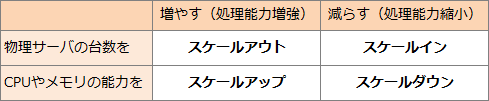

# [令和5年春期 午前 問13](https://www.ap-siken.com/kakomon/05_haru/q13.html)

#問題 #テクノロジ #システム構成要素 #システムの構成

解説を表示解説を隠す

<strong>問13</strong>　スケールインの説明として，適切なものはどれか。

<ul class="ap-choices">
<li class="ap-choice-item ap-wrong">

ア　想定されるCPU使用率に対して，サーバの能力が過剰なとき，CPUの能力を減らすこと

スケールダウンの説明。

</li>
<li class="ap-choice-item ap-correct">

イ　想定されるシステムの処理量に対して，サーバの台数が過剰なとき，サーバの台数を減らすこと

正しい。スケールインの説明。

</li>
<li class="ap-choice-item ap-wrong">

ウ　想定されるシステムの処理量に対して，サーバの台数が不足するとき，サーバの台数を増やすこと

<a href="用語/スケールアウト" class="internal-link" data-href="用語/スケールアウト">スケールアウト</a>の説明。

</li>
<li class="ap-choice-item ap-wrong">

エ　想定されるメモリ使用率に対して，サーバの能力が不足するとき，メモリの容量を増やすこと

<a href="用語/スケールアップ" class="internal-link" data-href="用語/スケールアップ">スケールアップ</a>の説明。

</li>
</ul>

<h4>解説</h4>

システムの能力を増強する方法として<a href="用語/スケールアウト" class="internal-link" data-href="用語/スケールアウト">スケールアウト</a>と<a href="用語/スケールアップ" class="internal-link" data-href="用語/スケールアップ">スケールアップ</a>、逆に縮小する方法としてスケールインとスケールダウンがあります。

スケールインは、システムに余剰能力があるときに、物理サーバの台数を減らすことでシステムの能力を縮小することです。したがって「イ」が正解です。

