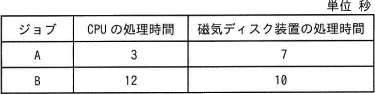
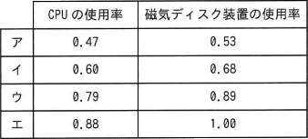
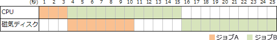

# [令和5年春期 午前 問14](https://www.ap-siken.com/kakomon/05_haru/q14.html)

#問題 #テクノロジ #ソフトウェア #オペレーティングシステム

解説を表示解説を隠す

<strong>問14</strong>　CPUと磁気ディスク装置で構成されるシステムで，表に示すジョブA，Bを実行する。この二つのジョブが実行を終了するまでのCPUの使用率と磁気ディスク装置の使用率との組み合わせのうち，適切なものはどれか。ここで，ジョブA，Bはシステムの動作開始時点ではいずれも実行可能状態にあり，A，Bの順で実行される。CPU及び磁気ディスク装置は，ともに一つの要求だけを発生順に処理する。ジョブA，Bとも，CPUの処理を終了した後，磁気ディスク装置の処理を実行する。  

<ul class="ap-choices">
<li class="ap-choice-item ap-wrong">

ア

<a href="用語/CPU" class="internal-link" data-href="用語/CPU">CPU</a>の使用率と磁気ディスク装置の使用率の組合せが誤っています。組合せは選択肢表を参照してください。

</li>
<li class="ap-choice-item ap-correct">

イ

正しい。<a href="用語/CPU" class="internal-link" data-href="用語/CPU">CPU</a>の使用率15秒÷25秒＝0.60、磁気ディスク装置の使用率17秒÷25秒＝0.68です。

</li>
<li class="ap-choice-item ap-wrong">

ウ

<a href="用語/CPU" class="internal-link" data-href="用語/CPU">CPU</a>の使用率と磁気ディスク装置の使用率の組合せが誤っています。組合せは選択肢表を参照してください。

</li>
<li class="ap-choice-item ap-wrong">

エ

<a href="用語/CPU" class="internal-link" data-href="用語/CPU">CPU</a>の使用率と磁気ディスク装置の使用率の組合せが誤っています。組合せは選択肢表を参照してください。

</li>
</ul>

<h4>解説</h4>

各1つの<a href="用語/CPU" class="internal-link" data-href="用語/CPU">CPU</a>と磁気ディスク装置を使い、ジョブA→Bの順で処理をすると、<a href="用語/CPU" class="internal-link" data-href="用語/CPU">CPU</a>と磁気ディスクの使用状況は下の図で示すようになります。

2つのジョブが終了するまでに要する時間は25秒で、そのうち色が付いている部分が各機器を使用している時間です。

<a href="用語/CPU" class="internal-link" data-href="用語/CPU">CPU</a>の使用率　15秒÷25秒＝0.60

磁気ディスク装置の使用率　17秒÷25秒＝0.68

したがって「イ」の組合せが正解です。

