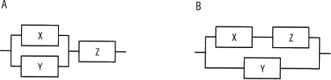

# [令和5年春期 午前 問16](https://www.ap-siken.com/kakomon/05_haru/q16.html)

#問題 #テクノロジ #システム構成要素 #システムの評価指標

解説を表示解説を隠す

<strong>問16</strong>　3台の装置X～Zを接続したシステムA，Bの稼働率に関する記述のうち，適切なものはどれか。ここで，3台の装置の稼働率は，いずれも0より大きく1より小さいものとし，並列に接続されている部分は，どちらか一方が稼働していればよいものとする。 

<ul class="ap-choices">
<li class="ap-choice-item ap-wrong">

ア　各装置の稼働率の値によって，AとBの稼働率のどちらが高いかは変化する。

式の比較では常にBの<a href="用語/稼働率" class="internal-link" data-href="用語/稼働率">稼働率</a>がAより大きくなるため誤りです。

</li>
<li class="ap-choice-item ap-wrong">

イ　常にAとBの稼働率は等しい。

AとBの<a href="用語/稼働率" class="internal-link" data-href="用語/稼働率">稼働率</a>の式は一致せず、常にBの方が大きいため誤りです。

</li>
<li class="ap-choice-item ap-wrong">

ウ　常にAの稼働率はBより高い。

比較の結果はA＜Bであり、記述と逆の関係のため誤りです。

</li>
<li class="ap-choice-item ap-correct">

エ　常にBの稼働率はAより高い。

正しい。<a href="用語/稼働率" class="internal-link" data-href="用語/稼働率">稼働率</a>の式を比較すると、0＜x,y,z＜1の条件下で常にBの<a href="用語/稼働率" class="internal-link" data-href="用語/稼働率">稼働率</a>がAより大きくなります。

</li>
</ul>

<h4>解説</h4>

<a href="用語/稼働率" class="internal-link" data-href="用語/稼働率">稼働率</a>がそれぞれRa、Rbの機器がある場合、2つが直列接続されているときの全体としての<a href="用語/稼働率" class="internal-link" data-href="用語/稼働率">稼働率</a>はRa×Rb、並列で接続されているときの<a href="用語/稼働率" class="internal-link" data-href="用語/稼働率">稼働率</a>は1－(1－Ra)(1－Rb)の式で表すことができます。

3つの装置X～Zの<a href="用語/稼働率" class="internal-link" data-href="用語/稼働率">稼働率</a>をそれぞれx～zとすると、システムA、Bの<a href="用語/稼働率" class="internal-link" data-href="用語/稼働率">稼働率</a>は次の式で表せます。

【システムA】 (1－(1－x)(1－y))・z ＝(1－(1－x－y＋xy))・z ＝(x＋y－xy)・z ＝xz＋yz－xyz

【システムB】 1－(1－x・z)(1－y) ＝1－(1－y－xz＋xyz) ＝xz＋y－xyz

2つの式を比較すると「xz－xyz」の部分は同じで、異なるのは「yz」と「y」の項だけです。3台の装置の<a href="用語/稼働率" class="internal-link" data-href="用語/稼働率">稼働率</a>は、いずれも0より大きく1より小さいので、常に「yz＜y」の関係となり、結果として以下の式が成り立ちます。

xz＋yz－xyz＜xz＋y－xyz （Aの<a href="用語/稼働率" class="internal-link" data-href="用語/稼働率">稼働率</a>＜Bの<a href="用語/稼働率" class="internal-link" data-href="用語/稼働率">稼働率</a>）

したがって、「常にBの<a href="用語/稼働率" class="internal-link" data-href="用語/稼働率">稼働率</a>が高い」という記述が適切です。

