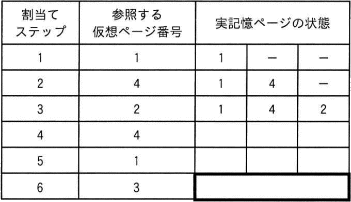
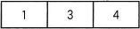
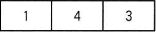
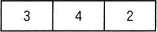
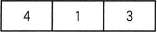
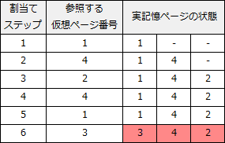

# [令和5年春期 午前 問17](https://www.ap-siken.com/kakomon/05_haru/q17.html)

#問題 #テクノロジ #ソフトウェア #オペレーティングシステム

解説を表示解説を隠す

<strong>問17</strong>　仮想記憶システムにおいて，ページ置換えアルゴリズムとしてFIFOを採用して，仮想ページ参照列1，4，2，4，1，3を3ページ枠の実記憶に割り当てて処理を行った。表の割当てステップ"3"までは，仮想ページ参照列中の最初の1，4，2をそれぞれ実記憶に割り当てた直後の実記憶ページの状態を示している。残りをすべて参照した直後の実記憶の状態を示す太枠部分に該当するものはどれか。 

<ul class="ap-choices">
<li class="ap-choice-item ap-wrong">

ア　

ステップ6終了後の<a href="用語/実記憶" class="internal-link" data-href="用語/実記憶">実記憶</a>の状態が誤り。

</li>
<li class="ap-choice-item ap-wrong">

イ　

ステップ6終了後の<a href="用語/実記憶" class="internal-link" data-href="用語/実記憶">実記憶</a>の状態が誤り。

</li>
<li class="ap-choice-item ap-correct">

ウ　

正しい。ページ3を<a href="用語/ページイン" class="internal-link" data-href="用語/ページイン">ページイン</a>し、<a href="用語/FIFO" class="internal-link" data-href="用語/FIFO">FIFO</a>でページ1を<a href="用語/ページアウト" class="internal-link" data-href="用語/ページアウト">ページアウト</a>した後は342。

</li>
<li class="ap-choice-item ap-wrong">

エ　

ステップ6終了後の<a href="用語/実記憶" class="internal-link" data-href="用語/実記憶">実記憶</a>の状態が誤り。

</li>
</ul>

<h4>解説</h4>

<a href="用語/FIFO" class="internal-link" data-href="用語/FIFO">FIFO</a>は、First In First Outの略で、早く入力されたデータから順に出力する「先入れ先出し」のことです。ページ置換えアルゴリズムとして<a href="用語/FIFO" class="internal-link" data-href="用語/FIFO">FIFO</a>を採用する場合、<a href="用語/ページイン" class="internal-link" data-href="用語/ページイン">ページイン</a>してから最も時間が経過しているページが置換え対象として選択されます。

設問の表では、最初の3つ（1，4，2）を割り当てたところまでは終わっているので、4つ目以降の割当てを考えていきます。

【ステップ4：ページ4】ページ4は<a href="用語/実記憶" class="internal-link" data-href="用語/実記憶">実記憶</a>上に存在しているので、ページの入替えは発生しません。142

【ステップ5：ページ1】ページ1は<a href="用語/実記憶" class="internal-link" data-href="用語/実記憶">実記憶</a>上に存在しているので、ページの入替えは発生しません。142

【ステップ6：ページ3】ページ3は<a href="用語/実記憶" class="internal-link" data-href="用語/実記憶">実記憶</a>上に存在しないのでページの入替えが発生します。<a href="用語/FIFO" class="internal-link" data-href="用語/FIFO">FIFO</a>により置換え対象として選択されるのは、ロードされているページ1，4，2のうち最も早く<a href="用語/ページイン" class="internal-link" data-href="用語/ページイン">ページイン</a>したページ1となります。よって、ページ1を<a href="用語/ページアウト" class="internal-link" data-href="用語/ページアウト">ページアウト</a>し、ページ3を<a href="用語/ページイン" class="internal-link" data-href="用語/ページイン">ページイン</a>する処理が行われます。342

したがって、割当てステップ6が終了した後の<a href="用語/実記憶" class="internal-link" data-href="用語/実記憶">実記憶</a>の状態は「ウ」になります。

