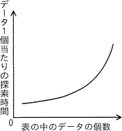
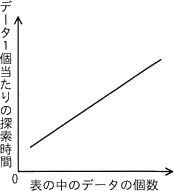
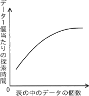
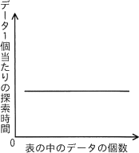

# [令和5年春期 午前 問19](https://www.ap-siken.com/kakomon/05_haru/q19.html)

#問題 #テクノロジ #アルゴリズムとプログラミング #アルゴリズム

解説を表示解説を隠す

<strong>問19</strong>　ハッシュ表の理論的な探索時間を示すグラフはどれか。ここで，複数のデータが同じハッシュ値になることはないものとする。

<ul class="ap-choices">
<li class="ap-choice-item ap-wrong">

ア　

データ数の増加に伴い探索時間が加速して増える形状であり，<a href="用語/衝突" class="internal-link" data-href="用語/衝突">衝突</a>のないハッシュ表の定数時間探索とは一致しません。

</li>
<li class="ap-choice-item ap-wrong">

イ　

データ数に比例して探索時間が増える線形の形状です。詳細：<a href="用語/線形探索法" class="internal-link" data-href="用語/線形探索法">線形探索法</a>

</li>
<li class="ap-choice-item ap-wrong">

ウ　

データ数の増加に伴い探索時間が対数的に増える形状です。詳細：<a href="用語/2分探索法" class="internal-link" data-href="用語/2分探索法">2分探索法</a>

</li>
<li class="ap-choice-item ap-correct">

エ　

正しい。表中のデータ数が増えても探索時間がほぼ一定のグラフです。

</li>
</ul>

<h4>解説</h4>

ハッシュ表は、キー(key)とそれに対応する値(value)の組を格納する<a href="用語/データ構造" class="internal-link" data-href="用語/データ構造">データ構造</a>です。

ハッシュ表では、キーと値の組を格納する際、キーに<a href="用語/ハッシュ関数" class="internal-link" data-href="用語/ハッシュ関数">ハッシュ関数</a>を使用して、格納する場所（<a href="用語/インデックス" class="internal-link" data-href="用語/インデックス">インデックス</a>）を一意に決め、そこに格納します。あるキーに対する値を取り出すときも、キーに<a href="用語/ハッシュ関数" class="internal-link" data-href="用語/ハッシュ関数">ハッシュ関数</a>を使用することで格納場所を特定し、一発で目的のデータを参照することが可能です。<a href="用語/ハッシュ関数" class="internal-link" data-href="用語/ハッシュ関数">ハッシュ関数</a>からハッシュ値を計算する速度はほぼ一定なので、ハッシュ表に格納されているデータの数にかかわらず、探索時間はほぼ一定（定数時間）となります。

<a href="用語/ハッシュ表探索法" class="internal-link" data-href="用語/ハッシュ表探索法">ハッシュ表探索</a>では、表中のデータの数が増えても探索時間は変わらないので、適切な関係を表すグラフは「エ」です。

