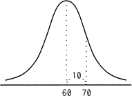
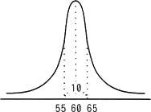
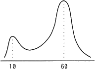
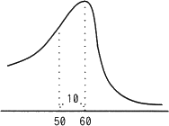
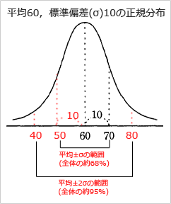

# [令和5年春期 午前 問2](https://www.ap-siken.com/kakomon/05_haru/q2.html)

#問題 #テクノロジ #基礎理論 #応用数学

解説を表示解説を隠す

<strong>問2</strong>　平均が60，標準偏差が10の正規分布を表すグラフはどれか。

<ul class="ap-choices">
<li class="ap-choice-item ap-correct">

ア　

正しい。平均60を中心に左右対称で，<a href="用語/標準偏差" class="internal-link" data-href="用語/標準偏差">標準偏差</a>±σの範囲60±10＝50～70を正しく表しています。

</li>
<li class="ap-choice-item ap-wrong">

イ　

平均は60ですが，<a href="用語/標準偏差" class="internal-link" data-href="用語/標準偏差">標準偏差</a>±σの範囲50～70を正しく表していません。

</li>
<li class="ap-choice-item ap-wrong">

ウ　

グラフが左右対称ではないため，<a href="用語/正規分布" class="internal-link" data-href="用語/正規分布">正規分布</a>として不適切です。

</li>
<li class="ap-choice-item ap-wrong">

エ　

グラフが左右対称ではないため，<a href="用語/正規分布" class="internal-link" data-href="用語/正規分布">正規分布</a>として不適切です。

</li>
</ul>

<h4>解説</h4>

<a href="用語/正規分布" class="internal-link" data-href="用語/正規分布">正規分布</a>は、<a href="用語/平均値" class="internal-link" data-href="用語/平均値">平均値</a>を中心に左右対称の山のようなカーブを描く確率分布で、平均と<a href="用語/標準偏差" class="internal-link" data-href="用語/標準偏差">標準偏差</a>だけで分布に関する全ての特性が規定できるという特徴があります。

<a href="用語/標準偏差" class="internal-link" data-href="用語/標準偏差">標準偏差</a>は、データの分布のばらつきを表す尺度で、<a href="用語/正規分布" class="internal-link" data-href="用語/正規分布">正規分布</a>では<a href="用語/平均値" class="internal-link" data-href="用語/平均値">平均値</a>と<a href="用語/標準偏差" class="internal-link" data-href="用語/標準偏差">標準偏差</a>(σ[シグマ])、および度数の間に次の関係が成り立っています。

<ul>
<li>平均±σの範囲に全体の約68%が含まれる</li>
<li>平均±2σの範囲に全体の約95%が含まれる</li>
<li>平均±3σの範囲に全体の約99%が含まれる</li>
</ul>

選択肢のグラフのうち、グラフが左右対称となっていない「ウ」と「エ」は明らかに不適切とわかります。「ア」と「イ」はどちらも平均が60ですが、<a href="用語/標準偏差" class="internal-link" data-href="用語/標準偏差">標準偏差</a>±σの範囲「60±10＝50～70」を正しく表しているのは「ア」のグラフです。

