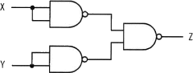
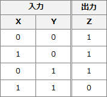
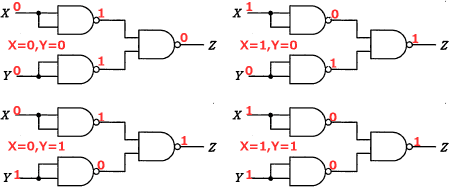
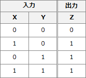

# [令和5年春期 午前 問21](https://www.ap-siken.com/kakomon/05_haru/q21.html)

#問題 #テクノロジ #ハードウェア

解説を表示解説を隠す

<strong>問21</strong>　NAND素子を用いた次の組合せ回路の出力Zを表す式はどれか。ここで，"・"は論理積，"＋"は論理和，"X"はXの否定を表す。 

<ul class="ap-choices">
<li class="ap-choice-item ap-wrong">

ア　X・Y

2入力の<a href="用語/論理積" class="internal-link" data-href="用語/論理積">論理積</a>であり、設問の回路の<a href="用語/真理値表" class="internal-link" data-href="用語/真理値表">真理値表</a>から得られる<a href="用語/論理和" class="internal-link" data-href="用語/論理和">論理和</a>とは等価ではない。

</li>
<li class="ap-choice-item ap-correct">

イ　X＋Y

正しい。<a href="用語/真理値表" class="internal-link" data-href="用語/真理値表">真理値表</a>より、設問の回路は2つの入力の<a href="用語/論理和" class="internal-link" data-href="用語/論理和">論理和</a>を得る<a href="用語/OR回路" class="internal-link" data-href="用語/OR回路">OR回路</a>と等価である。

</li>
<li class="ap-choice-item ap-wrong">

ウ　X・Y

2入力の<a href="用語/論理積" class="internal-link" data-href="用語/論理積">論理積</a>の否定であり、設問の回路の出力とは一致しない。

</li>
<li class="ap-choice-item ap-wrong">

エ　X＋Y

2入力の<a href="用語/論理和" class="internal-link" data-href="用語/論理和">論理和</a>の否定であり、設問の回路の出力とは一致しない。

</li>
</ul>

<h4>解説</h4>

<strong><a href="用語/NAND回路" class="internal-link" data-href="用語/NAND回路">NAND回路</a></strong>は、NAND(Not AND)の名称どおり<a href="用語/AND回路" class="internal-link" data-href="用語/AND回路">AND回路</a>の逆を出力する回路で、2つの入力がともに"1"のときだけ"0"を出力し、それ以外の入力では"1"を出力します。 

設問の回路に入力値XとYのすべての組合せ（X=0,Y=0・X=1,Y=0・X=0,Y=1・X=1, Y=1）を試すと、それぞれ以下の出力が得られます。 

上記結果の入力値XとYおよび出力値Zの関係を整理すると、次の<a href="用語/真理値表" class="internal-link" data-href="用語/真理値表">真理値表</a>が得られます。 

この<a href="用語/真理値表" class="internal-link" data-href="用語/真理値表">真理値表</a>より、設問の回路は2つの入力の<a href="用語/論理和" class="internal-link" data-href="用語/論理和">論理和</a>を得る<a href="用語/OR回路" class="internal-link" data-href="用語/OR回路">OR回路</a>と等価であることがわかるので、正解は「X＋Y」です。

【別解】 回路図を<a href="用語/論理式" class="internal-link" data-href="用語/論理式">論理式</a>で表し、その<a href="用語/論理式" class="internal-link" data-href="用語/論理式">論理式</a>を変形することで答えを導く解く方法もあります。

Z＝X・X・Y・Y 　＝X・X＋Y・Y　//<a href="用語/ド・モルガンの法則" class="internal-link" data-href="用語/ド・モルガンの法則">ド・モルガンの法則</a>を適用 　＝X・X＋Y・Y　//A＝A 　＝X＋Y　//A・A＝A

