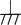
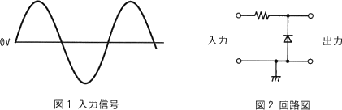
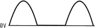
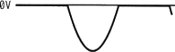
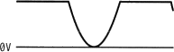
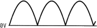
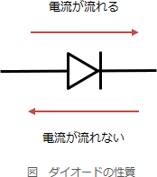
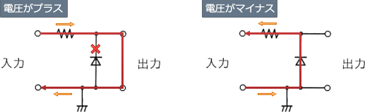
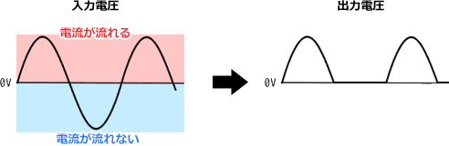

# [令和5年春期 午前 問22](https://www.ap-siken.com/kakomon/05_haru/q22.html)

#問題 #テクノロジ #ハードウェア

解説を表示解説を隠す

<strong>問22</strong>　図1の電圧波形の信号を，図2の回路に入力したときの出力電圧の波形はどれか。ここで，は抵抗(R)，はダイオード(D)，は接地を表す。なお，ダイオードの順電圧は0Vであるとする。 

<ul class="ap-choices">
<li class="ap-choice-item ap-correct">

ア　

正しい。マイナスの電圧が印加されたときに出力電圧がゼロとなる波形。

</li>
<li class="ap-choice-item ap-wrong">

イ　

マイナス側の入力がマイナスとして出力に現れる波形であり、マイナス時に出力がゼロとなる本問の動作と合わない。

</li>
<li class="ap-choice-item ap-wrong">

ウ　

入力の正負の波形がそのまま出力される波形であり、<a href="用語/ダイオード" class="internal-link" data-href="用語/ダイオード">ダイオード</a>回路による半波整流の出力とは異なる。

</li>
<li class="ap-choice-item ap-wrong">

エ　

全波整流のように正の半周期のみが連続する波形であり、本問の回路の出力（半波整流）とは異なる。

</li>
</ul>

<h4>解説</h4>

<a href="用語/ダイオード" class="internal-link" data-href="用語/ダイオード">ダイオード</a>は、電流を一方向にしか流さない性質をもつ電子部品です。電流に対する「弁」のように動作します。交流電流では一定周期ごとに電圧の流れる向きが変わりますが、<a href="用語/ダイオード" class="internal-link" data-href="用語/ダイオード">ダイオード</a>の作用を利用することで正電圧のみを取り出しています。

設問の図では下側が接地されているので、電圧がプラスのときは上の線から下の線に向けて電流が流れようとします。<a href="用語/ダイオード" class="internal-link" data-href="用語/ダイオード">ダイオード</a>の向きより上から下への電流は通さないため、電流は、<a href="用語/ダイオード" class="internal-link" data-href="用語/ダイオード">ダイオード</a>を含む線ではなく出力側に流れることになります。このため、電圧がプラスのときは入力側の電位差がそのまま出力側に表れます。

逆に、電圧がマイナスのときは下の線から上の線に向けて電流が流れようとします。<a href="用語/ダイオード" class="internal-link" data-href="用語/ダイオード">ダイオード</a>は下から上への電流を通すため、<a href="用語/ダイオード" class="internal-link" data-href="用語/ダイオード">ダイオード</a>を含む線により回路は短絡され、出力側には電流が流れません。このため、電圧がマイナスのときは出力側の電圧はゼロとなります。

したがって、マイナスの電圧が印加されたときに、出力電圧がゼロとなる「ア」の波形になります。

