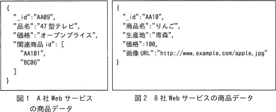

# [令和5年春期 午前 問26](https://www.ap-siken.com/kakomon/05_haru/q26.html)

#問題 #テクノロジ #データベース #データベース方式

解説を表示解説を隠す

<strong>問26</strong>　JSON形式で表現される図1，図2のような商品データを複数のWebサービスから取得し，商品データベースとして蓄積する際のデータの格納方法に関する記述のうち，適切なものはどれか。ここで，商品データの取得元となるWebサービスは随時変更され，項目数や内容は予測できない。したがって，商品データベースの検索時に使用するキーにはあらかじめ制限を設けない。 

<ul class="ap-choices">
<li class="ap-choice-item ap-wrong">

ア　階層型データベースを使用し，項目名を上位階層とし，値を下位階層とした2階層でデータを格納する。

<a href="用語/階層型" class="internal-link" data-href="用語/階層型">階層型</a><a href="用語/データベース" class="internal-link" data-href="用語/データベース">データベース</a>は組織図のような親子関係で管理する方式であり、項目名と値は親子関係に当たらないため不適切です。

</li>
<li class="ap-choice-item ap-wrong">

イ　グラフデータベースを使用し，商品データの項目名の集合から成るノードと値の集合から成るノードを作り，二つのノードを関係付けたグラフとしてデータを格納する。

商品ごとにノードとキーバリュー形式で格納する案はあるが、取得元の変更や値の重複・将来変更の可能性から本問の条件には不適切です。

</li>
<li class="ap-choice-item ap-correct">

ウ　ドキュメントデータベースを使用し，項目構成の違いを区別せず，商品データ単位にデータを格納する。

正しい。<a href="用語/JSON" class="internal-link" data-href="用語/JSON">JSON</a>形式で項目数・内容が変化しうるデータは、スキーマレスのドキュメント型<a href="用語/データベース" class="internal-link" data-href="用語/データベース">データベース</a>が適しています。

</li>
<li class="ap-choice-item ap-wrong">

エ　関係データベースを使用し，商品データの各項目名を個別の列名とした表を定義してデータを格納する。

2次元表形式の関係<a href="用語/データベース" class="internal-link" data-href="用語/データベース">データベース</a>は、項目数・項目名・値のドメインが統一されず将来変化しうる本問のデータには適していません。

</li>
</ul>

<h4>解説</h4>

<a href="用語/階層型" class="internal-link" data-href="用語/階層型">階層型</a><a href="用語/データベース" class="internal-link" data-href="用語/データベース">データベース</a>は、会社の組織図のようにデータをツリー構造(親子関係)で管理する<a href="用語/データベース" class="internal-link" data-href="用語/データベース">データベース</a>です。項目名と値は親子関係に当たらないため不適切です。

グラフ型<a href="用語/データベース" class="internal-link" data-href="用語/データベース">データベース</a>は、グラフ理論に基づき、「ノード」「エッジ」「プロパティ」の3要素でデータ間の関係性を表現する<a href="用語/データベース" class="internal-link" data-href="用語/データベース">データベース</a>です。もし、グラフ型<a href="用語/データベース" class="internal-link" data-href="用語/データベース">データベース</a>で実装するなら、商品ごとにノードを作成し、項目名と値をキーバリューストア形式で格納し、商品同士の関連をエッジで表現します。しかし、この設問では商品を一意に特定する"_id"も含め、Webサービス同士で値が重複したり、将来変更されたりする可能性があるため不適切です。

ドキュメント型<a href="用語/データベース" class="internal-link" data-href="用語/データベース">データベース</a>は、<a href="用語/XML" class="internal-link" data-href="用語/XML">XML</a>や<a href="用語/JSON" class="internal-link" data-href="用語/JSON">JSON</a>などの構造でデータを格納する<a href="用語/データベース" class="internal-link" data-href="用語/データベース">データベース</a>です。保存するデータ形式が自由なので、複雑な<a href="用語/データ構造" class="internal-link" data-href="用語/データ構造">データ構造</a>をもつデータを扱うときに用いられます。1つの<a href="用語/XML" class="internal-link" data-href="用語/XML">XML</a>や<a href="用語/JSON" class="internal-link" data-href="用語/JSON">JSON</a>ごとに1件のデータとして保存されます。本問では、どちらも<a href="用語/JSON" class="internal-link" data-href="用語/JSON">JSON</a>形式のデータであり、入れ子構造を含む複雑な形式であること、項目数や内容が変化する可能性があることから、スキーマレスのドキュメント型<a href="用語/データベース" class="internal-link" data-href="用語/データベース">データベース</a>が適しています。

リレーショナル<a href="用語/データベース" class="internal-link" data-href="用語/データベース">データベース</a>は、2次元の表形式でデータを管理する<a href="用語/データベース" class="internal-link" data-href="用語/データベース">データベース</a>です。商品データは、項目数、項目名及び値のドメインが統一されていないこと、将来項目数や内容が変化する可能性があることから適していません。

