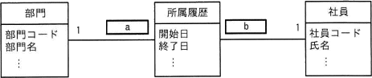
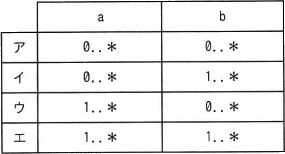
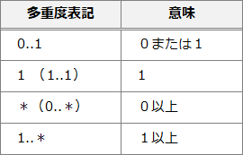

# [令和5年春期 午前 問29](https://www.ap-siken.com/kakomon/05_haru/q29.html)

#問題 #テクノロジ #データベース #データベース設計

解説を表示解説を隠す

<strong>問29</strong>　UMLを用いて表した図のデータモデルのa，bに入れる多重度はどれか。  〔条件〕 部門には1人以上の社員が所属する。 社員はいずれか一つの部門に所属する。 社員が部門に所属した履歴を所属履歴として記録する。  

<ul class="ap-choices">
<li class="ap-choice-item ap-wrong">

ア

aまたはbの多重度が、設問の条件から導かれる組合せと一致しません。

</li>
<li class="ap-choice-item ap-wrong">

イ

aまたはbの多重度が、設問の条件から導かれる組合せと一致しません。

</li>
<li class="ap-choice-item ap-wrong">

ウ

aまたはbの多重度が、設問の条件から導かれる組合せと一致しません。

</li>
<li class="ap-choice-item ap-correct">

エ

正しい。aとbともに「1..*」の組合せが条件から導かれます。

</li>
</ul>

<h4>解説</h4>

多重度とは、ある<a href="用語/クラス" class="internal-link" data-href="用語/クラス">クラス</a>の<a href="用語/インスタンス" class="internal-link" data-href="用語/インスタンス">インスタンス</a>1つにつき、他方の<a href="用語/クラス" class="internal-link" data-href="用語/クラス">クラス</a>の<a href="用語/インスタンス" class="internal-link" data-href="用語/インスタンス">インスタンス</a>がいくつ<a href="用語/関連" class="internal-link" data-href="用語/関連">関連</a>するかという数を示します。<a href="用語/クラス図" class="internal-link" data-href="用語/クラス図">クラス図</a>における多重度の表記法とその意味は以下のとおりです。

〔aについて〕 部門<a href="用語/クラス" class="internal-link" data-href="用語/クラス">クラス</a>の<a href="用語/インスタンス" class="internal-link" data-href="用語/インスタンス">インスタンス</a>から見た所属履歴の数が入ります。 所属社員1人につき1つの所属履歴が記録されます。1つの部門には1人以上の社員が所属するので、1つの部門と<a href="用語/関連" class="internal-link" data-href="用語/関連">関連</a>する所属履歴も1つ以上ということになります。したがってaには「1..*」が入ります。

〔bについて〕 社員<a href="用語/クラス" class="internal-link" data-href="用語/クラス">クラス</a>の<a href="用語/インスタンス" class="internal-link" data-href="用語/インスタンス">インスタンス</a>から見た所属履歴の数が入ります。 社員はいずれか一つの部門に所属しますが、部署異動の可能性を考えれば、1人の社員には1つまたは複数の所属履歴が存在することになります。したがってbには「1..*」が入ります。

以上より、正しい組合せは「エ」になります。

