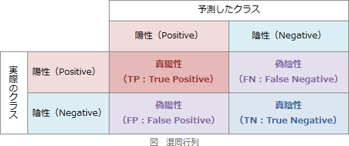
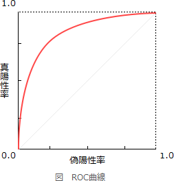

# [令和5年春期 午前 問3](https://www.ap-siken.com/kakomon/05_haru/q3.html)

#問題 #テクノロジ #基礎理論 #情報に関する理論

解説を表示解説を隠す

<strong>問3</strong>　AIにおける機械学習で，2クラス分類モデルの評価方法として用いられるROC曲線の説明として，適切なものはどれか。

<ul class="ap-choices">
<li class="ap-choice-item ap-correct">

ア　真陽性率と偽陽性率の関係を示す曲線である。

正しい。<a href="用語/ROC曲線" class="internal-link" data-href="用語/ROC曲線">ROC曲線</a>は縦軸に真陽性率、横軸に偽陽性率をとった曲線です。

</li>
<li class="ap-choice-item ap-wrong">

イ　真陽性率と適合率の関係を示す曲線である。

<a href="用語/PR曲線" class="internal-link" data-href="用語/PR曲線">PR曲線</a>（Precision Recall Curve）の説明です。

</li>
<li class="ap-choice-item ap-wrong">

ウ　正解率と適合率の関係を示す曲線である。

<a href="用語/ROC曲線" class="internal-link" data-href="用語/ROC曲線">ROC曲線</a>の縦軸・横軸の組み合わせではありません。

</li>
<li class="ap-choice-item ap-wrong">

エ　適合率と偽陽性率の関係を示す曲線である。

<a href="用語/ROC曲線" class="internal-link" data-href="用語/ROC曲線">ROC曲線</a>の縦軸・横軸の組み合わせではありません。

</li>
</ul>

<h4>解説</h4>

与えられたデータを「はい・いいえ」「陽性・陰性」などの2つのクラスに分類する<a href="用語/機械学習" class="internal-link" data-href="用語/機械学習">機械学習</a>モデルにおける判定結果は、AIが予測したクラスと実際のクラス分類の関係から、真陽性、偽陽性、真陰性、偽陰性の4つに分けることができます。この4つの値を使って2値分類モデルの精度を示す指標として、<a href="用語/正解率" class="internal-link" data-href="用語/正解率">正解率</a>、<a href="用語/再現率" class="internal-link" data-href="用語/再現率">再現率</a>(真陽性率)、<a href="用語/適合率" class="internal-link" data-href="用語/適合率">適合率</a>、特異度、偽陽性率などがあります。

<a href="用語/正解率" class="internal-link" data-href="用語/正解率">正解率</a>：実際のクラスと同じクラスを予測した割合　(TP＋TN)／(TP＋FN＋FP＋TN) <a href="用語/適合率" class="internal-link" data-href="用語/適合率">適合率</a>：陽性と予測したものうち実際に陽性だった割合　TP／(TP＋FP) 真陽性率（<a href="用語/再現率" class="internal-link" data-href="用語/再現率">再現率</a>、感度）：実際に陽性のものを正しく陽性と予測した割合　TP／(TP＋FN) 特異度：実際に陰性のものを正しく陰性と予測した割合　TN／(FP＋TN) 偽陽性率：実際に陰性のものを誤って陽性と予測した割合　FP／(FP＋TN)

<a href="用語/ROC曲線" class="internal-link" data-href="用語/ROC曲線">ROC曲線</a>は、縦軸に真陽性率、横軸に偽陽性率にとったグラフ上で、陽性・陰性の判断基準となる<a href="用語/しきい値" class="internal-link" data-href="用語/しきい値">しきい値</a>を動かしながら、各点での真陽性率と偽陽性率を打点していくことで描かれる曲線です。真陽性率と偽陽性率はトレードオフの関係にありますが、高い真陽性率を維持しつつ、偽陽性率をどれだけ抑えたモデルとなっているかを可視化することができます。したがって「ア」が正解です。

なお「イ」は、<a href="用語/ROC曲線" class="internal-link" data-href="用語/ROC曲線">ROC曲線</a>と同じく、2値分類モデルの<a href="用語/性能評価" class="internal-link" data-href="用語/性能評価">性能評価</a>に使われる<a href="用語/PR曲線" class="internal-link" data-href="用語/PR曲線">PR曲線</a>(Precision Recall Curve)の説明です。

