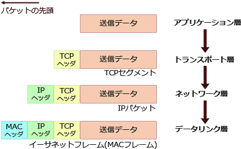

# [令和5年春期 午前 問33](https://www.ap-siken.com/kakomon/05_haru/q33.html)

#問題 #テクノロジ #ネットワーク #通信プロトコル

解説を表示解説を隠す

<strong>問33</strong>　1個のTCPパケットをイーサネットに送出したとき，イーサネットフレームに含まれる宛先情報の，送出順序はどれか。

<ul class="ap-choices">
<li class="ap-choice-item ap-wrong">

ア　宛先IPアドレス，宛先MACアドレス，宛先ポート番号

イーサネットフレームでは<a href="用語/データリンク層" class="internal-link" data-href="用語/データリンク層">データリンク層</a>の<a href="用語/MAC" class="internal-link" data-href="用語/MAC">MAC</a><a href="用語/ヘッダー" class="internal-link" data-href="用語/ヘッダー">ヘッダー</a>が最外層なので、宛先<a href="用語/MAC" class="internal-link" data-href="用語/MAC">MAC</a>アドレスが先ではない。

</li>
<li class="ap-choice-item ap-wrong">

イ　宛先IPアドレス，宛先ポート番号，宛先MACアドレス

宛先<a href="用語/IPアドレス" class="internal-link" data-href="用語/IPアドレス">IPアドレス</a>が先となっており、最外層の宛先<a href="用語/MAC" class="internal-link" data-href="用語/MAC">MAC</a>アドレスの順序になっていない。

</li>
<li class="ap-choice-item ap-correct">

ウ　宛先MACアドレス，宛先IPアドレス，宛先ポート番号

正しい。<a href="用語/ヘッダー" class="internal-link" data-href="用語/ヘッダー">ヘッダー</a>の付加が新しいものから順に、宛先<a href="用語/MAC" class="internal-link" data-href="用語/MAC">MAC</a>アドレス・宛先<a href="用語/IPアドレス" class="internal-link" data-href="用語/IPアドレス">IPアドレス</a>・宛先<a href="用語/ポート番号" class="internal-link" data-href="用語/ポート番号">ポート番号</a>となる。

</li>
<li class="ap-choice-item ap-wrong">

エ　宛先MACアドレス，宛先ポート番号，宛先IPアドレス

宛先<a href="用語/MAC" class="internal-link" data-href="用語/MAC">MAC</a>アドレスの次が<a href="用語/ポート番号" class="internal-link" data-href="用語/ポート番号">ポート番号</a>となっており、<a href="用語/ネットワーク層" class="internal-link" data-href="用語/ネットワーク層">ネットワーク層</a>の宛先<a href="用語/IPアドレス" class="internal-link" data-href="用語/IPアドレス">IPアドレス</a>より前になっている。

</li>
</ul>

<h4>解説</h4>

アプリケーションから送信されたデータは、<a href="用語/OSI基本参照モデル" class="internal-link" data-href="用語/OSI基本参照モデル">OSI基本参照モデル</a>（<a href="用語/TCP/IP" class="internal-link" data-href="用語/TCP/IP">TCP/IP</a>階層モデル）の各層ごとの<a href="用語/ヘッダー" class="internal-link" data-href="用語/ヘッダー">ヘッダー</a>が付加されて次の階層に渡されていきます。<a href="用語/アプリケーション層" class="internal-link" data-href="用語/アプリケーション層">アプリケーション層</a>で生成されたデータは、<a href="用語/トランスポート層" class="internal-link" data-href="用語/トランスポート層">トランスポート層</a>では<a href="用語/ポート番号" class="internal-link" data-href="用語/ポート番号">ポート番号</a>を含む「<a href="用語/TCP" class="internal-link" data-href="用語/TCP">TCP</a><a href="用語/ヘッダー" class="internal-link" data-href="用語/ヘッダー">ヘッダー</a>」、<a href="用語/ネットワーク層" class="internal-link" data-href="用語/ネットワーク層">ネットワーク層</a>では<a href="用語/IPアドレス" class="internal-link" data-href="用語/IPアドレス">IPアドレス</a>を含む「IP<a href="用語/ヘッダー" class="internal-link" data-href="用語/ヘッダー">ヘッダー</a>」、<a href="用語/データリンク層" class="internal-link" data-href="用語/データリンク層">データリンク層</a>では<a href="用語/MAC" class="internal-link" data-href="用語/MAC">MAC</a>アドレスを含む「<a href="用語/MAC" class="internal-link" data-href="用語/MAC">MAC</a><a href="用語/ヘッダー" class="internal-link" data-href="用語/ヘッダー">ヘッダー</a>」がそれぞれ付加されます。

イーサネットフレームは、<a href="用語/データリンク層" class="internal-link" data-href="用語/データリンク層">データリンク層</a>で通信を行うための<a href="用語/MAC" class="internal-link" data-href="用語/MAC">MAC</a><a href="用語/ヘッダー" class="internal-link" data-href="用語/ヘッダー">ヘッダー</a>を付加したデータなので、<a href="用語/ヘッダー" class="internal-link" data-href="用語/ヘッダー">ヘッダー</a>の送出順序は上の図のとおり、<a href="用語/ヘッダー" class="internal-link" data-href="用語/ヘッダー">ヘッダー</a>の付加が新しいものから順に、宛先<a href="用語/MAC" class="internal-link" data-href="用語/MAC">MAC</a>アドレス・宛先<a href="用語/IPアドレス" class="internal-link" data-href="用語/IPアドレス">IPアドレス</a>・宛先<a href="用語/ポート番号" class="internal-link" data-href="用語/ポート番号">ポート番号</a>となっています。したがって「ウ」が正解です。

