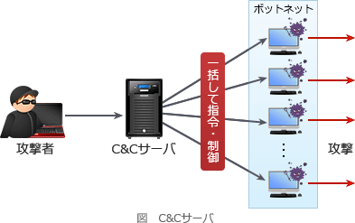

# [令和5年春期 午前 問36](https://www.ap-siken.com/kakomon/05_haru/q36.html)

#問題 #テクノロジ #セキュリティ #情報セキュリティ

解説を表示解説を隠す

<strong>問36</strong>　ボットネットにおいてC&amp;Cサーバが担う役割はどれか。

<ul class="ap-choices">
<li class="ap-choice-item ap-correct">

ア　遠隔操作が可能なマルウェアに，情報収集及び攻撃活動を指示する。

正しい。<a href="用語/C&Cサーバ" class="internal-link" data-href="用語/C&Cサーバ">C&amp;Cサーバ</a>は<a href="用語/ボットネット" class="internal-link" data-href="用語/ボットネット">ボットネット</a>上のマルウェアに対して指令を送り、乗っ取ったコンピュータで悪意のある活動を行わせる。

</li>
<li class="ap-choice-item ap-wrong">

イ　攻撃の踏み台となった複数のサーバからの通信を制御して遮断する。

踏み台サーバからの通信を遮断するのは防御側の対策であり、<a href="用語/C&Cサーバ" class="internal-link" data-href="用語/C&Cサーバ">C&amp;Cサーバ</a>が<a href="用語/ボットネット" class="internal-link" data-href="用語/ボットネット">ボットネット</a>に対して担う役割ではない。

</li>
<li class="ap-choice-item ap-wrong">

ウ　電子商取引事業者などへの偽のデジタル証明書の発行を命令する。

偽のデジタル証明書の発行命令は本問の<a href="用語/C&Cサーバ" class="internal-link" data-href="用語/C&Cサーバ">C&amp;Cサーバ</a>の役割の説明ではない。

</li>
<li class="ap-choice-item ap-wrong">

エ　不正なWebコンテンツのテキスト，画像及びレイアウト情報を一元的に管理する。

不正Webコンテンツの一元管理は<a href="用語/C&Cサーバ" class="internal-link" data-href="用語/C&Cサーバ">C&amp;Cサーバ</a>の役割ではなく、<a href="用語/ボットネット" class="internal-link" data-href="用語/ボットネット">ボットネット</a>の遠隔制御・指令とは別の話である。

</li>
</ul>

<h4>解説</h4>

<a href="用語/C&Cサーバ" class="internal-link" data-href="用語/C&Cサーバ">C&amp;Cサーバ</a>(コマンド・コントロール・サーバ)は、マルウェアが侵入に成功したコンピュータ群(<a href="用語/ボットネット" class="internal-link" data-href="用語/ボットネット">ボットネット</a>)の動作を制御するために用いられる外部の指令サーバです。

マルウェアは<a href="用語/C&Cサーバ" class="internal-link" data-href="用語/C&Cサーバ">C&amp;Cサーバ</a>からの指令を受けて、乗っ取ったコンピュータで悪意のある活動を行います。単純に外部から内部ネットワークに存在するマルウェアに対して通信を試みてもFWなどで遮断されてしまうため、マルウェア側から<a href="用語/C&Cサーバ" class="internal-link" data-href="用語/C&Cサーバ">C&amp;Cサーバ</a>に対して定期的に問い合わせを行い、その応答を使って指令を行う仕組みが用いられています。この仕組みを「コネクトバック通信」といいます。

したがって、<a href="用語/C&Cサーバ" class="internal-link" data-href="用語/C&Cサーバ">C&amp;Cサーバ</a>の役割を説明した記述は「ア」です。

