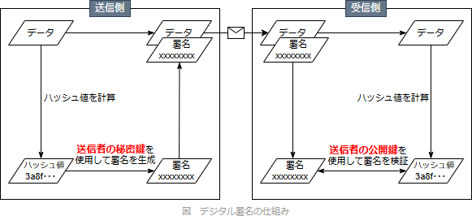

# [令和5年春期 午前 問38](https://www.ap-siken.com/kakomon/05_haru/q38.html)

#問題 #テクノロジ #セキュリティ #情報セキュリティ

解説を表示解説を隠す

<strong>問38</strong>　メッセージにRSA方式のデジタル署名を付与して2者間で送受信する。そのときのデジタル署名の検証鍵と使用方法はどれか。

<ul class="ap-choices">
<li class="ap-choice-item ap-wrong">

ア　受信者の公開鍵であり，送信者がメッセージダイジェストからデジタル署名を作成する際に使用する。

検証鍵は送信者の<a href="用語/公開鍵" class="internal-link" data-href="用語/公開鍵">公開鍵</a>。署名作成は送信者の<a href="用語/秘密鍵" class="internal-link" data-href="用語/秘密鍵">秘密鍵</a>。

</li>
<li class="ap-choice-item ap-wrong">

イ　受信者の秘密鍵であり，受信者がデジタル署名からメッセージダイジェストを算出する際に使用する。

検証に使うのは送信者の<a href="用語/公開鍵" class="internal-link" data-href="用語/公開鍵">公開鍵</a>。

</li>
<li class="ap-choice-item ap-correct">

ウ　送信者の公開鍵であり，受信者がデジタル署名からメッセージダイジェストを算出する際に使用する。

正しい。<a href="用語/デジタル署名" class="internal-link" data-href="用語/デジタル署名">デジタル署名</a>の検証に使用する鍵は送信者の<a href="用語/公開鍵" class="internal-link" data-href="用語/公開鍵">公開鍵</a>。

</li>
<li class="ap-choice-item ap-wrong">

エ　送信者の秘密鍵であり，送信者がメッセージダイジェストからデジタル署名を作成する際に使用する。

<a href="用語/秘密鍵" class="internal-link" data-href="用語/秘密鍵">秘密鍵</a>は署名の作成に使う。検証鍵の説明ではない。

</li>
</ul>

<h4>解説</h4>

<a href="用語/デジタル署名" class="internal-link" data-href="用語/デジタル署名">デジタル署名</a>の生成と検証の手順は次のとおりです。

送信者は、送信するメッセージのハッシュ値（<a href="用語/メッセージダイジェスト" class="internal-link" data-href="用語/メッセージダイジェスト">メッセージダイジェスト</a>）を生成し、それに送信者の<a href="用語/秘密鍵" class="internal-link" data-href="用語/秘密鍵">秘密鍵</a>で署名して、署名データを作成する

送信者は、署名データをメッセージに付加して送信する

受信者は、署名データ付きのメッセージを受信する

受信者は、受信したメッセージのハッシュ値と送信者の<a href="用語/公開鍵" class="internal-link" data-href="用語/公開鍵">公開鍵</a>を使用して、署名データを検証する

検証は、送信されたメッセージと受信したメッセージが同じであり、鍵ペアが正しい場合に限り成功する。これにより、通信内容が<a href="用語/改ざん" class="internal-link" data-href="用語/改ざん">改ざん</a>されていないことと送信者の正当性が確認できる

手順4のとおり、<a href="用語/デジタル署名" class="internal-link" data-href="用語/デジタル署名">デジタル署名</a>の検証に使用する鍵は「送信者の<a href="用語/公開鍵" class="internal-link" data-href="用語/公開鍵">公開鍵</a>」です。RSA方式の<a href="用語/デジタル署名" class="internal-link" data-href="用語/デジタル署名">デジタル署名</a>では、受信者は送信者の<a href="用語/公開鍵" class="internal-link" data-href="用語/公開鍵">公開鍵</a>を使って署名から<a href="用語/メッセージダイジェスト" class="internal-link" data-href="用語/メッセージダイジェスト">メッセージダイジェスト</a>を取り出し、受信したデータから自分で計算した<a href="用語/メッセージダイジェスト" class="internal-link" data-href="用語/メッセージダイジェスト">メッセージダイジェスト</a>が一致するかを確認します。この手順によりメッセージが<a href="用語/改ざん" class="internal-link" data-href="用語/改ざん">改ざん</a>されていないことが証明されます。

したがって「ウ」の記述が適切です。

