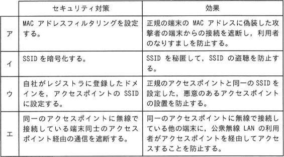
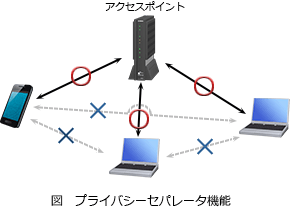

# [令和5年春期 午前 問43](https://www.ap-siken.com/kakomon/05_haru/q43.html)

#問題 #テクノロジ #セキュリティ #情報セキュリティ対策

解説を表示解説を隠す

<strong>問43</strong>　公衆無線LANのアクセスポイントを設置するときのセキュリティ対策とその効果の組みとして，適切なものはどれか。 

<ul class="ap-choices">
<li class="ap-choice-item ap-wrong">

ア

MACアドレスを偽装した端末からの接続は遮断できないため、対策と効果の組合せとして適切ではありません。

</li>
<li class="ap-choice-item ap-wrong">

イ

<a href="用語/SSID" class="internal-link" data-href="用語/SSID">SSID</a>を暗号化することはできません。<a href="用語/SSID" class="internal-link" data-href="用語/SSID">SSID</a>の秘匿には<a href="用語/SSID" class="internal-link" data-href="用語/SSID">SSID</a>ステルス等の設定が必要です。

</li>
<li class="ap-choice-item ap-wrong">

ウ

ドメイン名を<a href="用語/SSID" class="internal-link" data-href="用語/SSID">SSID</a>に用いる対策は、不正なアクセスポイント対策として意味がありません。

</li>
<li class="ap-choice-item ap-correct">

エ

正しい。プライバシーセパレータ（アクセスポイントアイソレーション）により、同一無線LAN上の端末同士の通信を禁止できます。

</li>
</ul>

<h4>解説</h4>

<a href="用語/MACアドレスフィルタリング" class="internal-link" data-href="用語/MACアドレスフィルタリング">MACアドレスフィルタリング</a>は、無線LANのアクセスポイントに正当な機器のMACアドレスを登録しておくことで、正当な機器以外からのアクセスを拒否する機能です。しかし、MACアドレスを正当なものに偽装している端末からの接続を遮断することはできません。

<a href="用語/SSID" class="internal-link" data-href="用語/SSID">SSID</a>を暗号化することはできません。<a href="用語/SSID" class="internal-link" data-href="用語/SSID">SSID</a>を秘匿にするためにはアクセスポイントに<a href="用語/SSID" class="internal-link" data-href="用語/SSID">SSID</a>ステルスの設定を行います。これにより、アクセスポイントから発せられるビーコンに<a href="用語/SSID" class="internal-link" data-href="用語/SSID">SSID</a>の情報が含まれなくなるため、第三者にアクセスポイントの<a href="用語/SSID" class="internal-link" data-href="用語/SSID">SSID</a>を知られてしまう危険性を低くできます。

ドメイン名は公開されていて、悪意のあるアクセスポイントの<a href="用語/SSID" class="internal-link" data-href="用語/SSID">SSID</a>として他者のドメインを設定することも可能なので、対策として意味がありません。不正なアクセスポイントの設置に対しては、<a href="用語/SSID" class="internal-link" data-href="用語/SSID">SSID</a>や暗号化キーを類推できないものにすることがある程度の対策になります。

正しい。無線LANのプライバシーセパレータ機能（アクセスポイントアイソレーション）についての記述です。プライバシーセパレータは、同一の無線LANに接続された子機同士の通信を禁止する機能です。店舗内Wi-fiや公衆無線LANサービスのように見知らぬ他人同士が同じ無線LANに接続する場面で、利用者のセキュリティ保護のために設定されます。 

