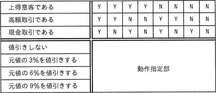
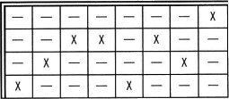
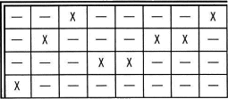
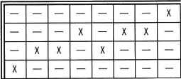
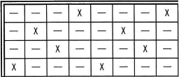
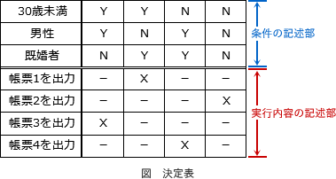
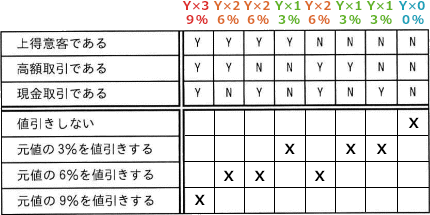

# [令和5年春期 午前 問47](https://www.ap-siken.com/kakomon/05_haru/q47.html)

#問題 #テクノロジ #システム開発技術 #設計

解説を表示解説を隠す

<strong>問47</strong>　値引き条件に従って，商品を販売する。決定表の動作指定部のうち，適切なものはどれか。  〔値引き条件〕 ①上得意客(前年度の販売金額の合計が800万円以上の顧客)であれば，元値の3%を値引きする。 ②高額取引(販売金額が100万円以上の取引)であれば，元値の3%を値引きする。 ③現金取引であれば，元値の3%を値引きする。 ④①～③の値引き条件は同時に適用する。 〔決定表〕 

<ul class="ap-choices">
<li class="ap-choice-item ap-wrong">

ア　

動作指定部の値引き率が，条件部の「Y」の数×3%と一致しない。

</li>
<li class="ap-choice-item ap-wrong">

イ　

動作指定部の値引き率が，条件部の「Y」の数×3%と一致しない。

</li>
<li class="ap-choice-item ap-correct">

ウ　

正しい。条件部の「Y」の数に応じた値引き率となっており，「X」の位置も条件の組合せと合致する。

</li>
<li class="ap-choice-item ap-wrong">

エ　

動作指定部の値引き率が，条件部の「Y」の数×3%と一致しない。

</li>
</ul>

<h4>解説</h4>

<a href="用語/決定表" class="internal-link" data-href="用語/決定表">決定表</a>(<a href="用語/デシジョンテーブル" class="internal-link" data-href="用語/デシジョンテーブル">デシジョンテーブル</a>)は、ある事象について条件や選択肢を表形式で整理し、記述された条件・選択肢の組合せによってどのような処理を行うべきかを列挙したものです。

下記の例でいえば、表中の二重線より上が条件を記述する部分で、条件が成立するときは「Y」(Yes)、不成立の時は「N」(No)を記入します。二重線より下が実行される処理を記述する部分で、条件の組合せによって実行すべき処理に「X」(eXecute=実行)を記入します。

設問の条件①～③の割引きはそれぞれ3％の割引率であり、条件④により重複して適用されるので、値引き率が<a href="用語/決定表" class="internal-link" data-href="用語/決定表">決定表</a>の条件部の「"Y"の数×3%」になっていればOKです。したがって、条件部に対する適切な値引き率は以下のようになります。

「X」の位置に注目すると、全部が合致している「ウ」が正解とわかります。

