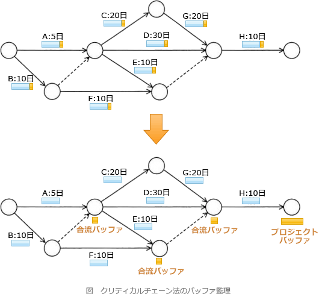

# [令和5年春期 午前 問52](https://www.ap-siken.com/kakomon/05_haru/q52.html)

#問題 #マネジメント #プロジェクトマネジメント #プロジェクトの時間

解説を表示解説を隠す

<strong>問52</strong>　クリティカルチェーン法に基づいてスケジュールネットワーク上にバッファを設ける。クリティカルチェーン上にないアクティビティが遅延してもクリティカルチェーン上のアクティビティに影響しないように，クリティカルチェーンにつながっていくアクティビティの直後に設けるバッファはどれか。

<ul class="ap-choices">
<li class="ap-choice-item ap-correct">

ア　合流バッファ

正しい。<a href="用語/プロジェクトバッファ／合流バッファ" class="internal-link" data-href="用語/プロジェクトバッファ／合流バッファ">合流バッファ</a>は、クリティカルチェーン上にない作業の遅れがクリティカルチェーン上のタスクに影響しないよう，作業の合流地点に配置するバッファです。

</li>
<li class="ap-choice-item ap-wrong">

イ　資源バッファ

資源バッファはクリティカルチェーン法で使用されるバッファではありません。

</li>
<li class="ap-choice-item ap-wrong">

ウ　フレームバッファ

フレームバッファはクリティカルチェーン法で使用されるバッファではありません。

</li>
<li class="ap-choice-item ap-wrong">

エ　プロジェクトバッファ

<a href="用語/プロジェクトバッファ／合流バッファ" class="internal-link" data-href="用語/プロジェクトバッファ／合流バッファ">プロジェクトバッファ</a>はクリティカルチェーンの最後に配置され，プロジェクト全体の完了日を守るためのバッファです。合流地点の直後に設けるバッファではありません。

</li>
</ul>

<h4>解説</h4>

クリティカルチェーン法は、<a href="用語/クリティカルパス" class="internal-link" data-href="用語/クリティカルパス">クリティカルパス</a>法の考え方にプロジェクト資源の制約の概念を加えて最短完了日数を算出する手法です。

クリティカルチェーン法では、個々の作業にバッファ(安全余裕時間)をもたせず、バッファをプロジェクト全体で管理します。プロジェクトの<a href="用語/クリティカルパス" class="internal-link" data-href="用語/クリティカルパス">クリティカルパス</a>を守るために、クリティカルチェーンの最後に配置されるものを「<a href="用語/プロジェクトバッファ／合流バッファ" class="internal-link" data-href="用語/プロジェクトバッファ／合流バッファ">プロジェクトバッファ</a>」、<a href="用語/クリティカルパス" class="internal-link" data-href="用語/クリティカルパス">クリティカルパス</a>上にない作業の遅れが、<a href="用語/クリティカルパス" class="internal-link" data-href="用語/クリティカルパス">クリティカルパス</a>上のタスクに影響を与えることを防ぐために作業の合流地点に配置されるものを「<a href="用語/プロジェクトバッファ／合流バッファ" class="internal-link" data-href="用語/プロジェクトバッファ／合流バッファ">合流バッファ</a>」といいます。

「クリティカルチェーンにつながっていくアクティビティの直後」という記述より、合流バッファであるとわかります。したがって「ア」が正解です。

なお、フレームバッファと資源バッファは、クリティカルチェーン法で使用されるバッファではありません。

