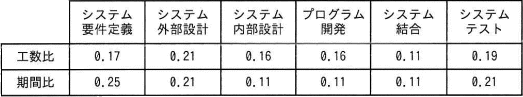

# [令和5年春期 午前 問53](https://www.ap-siken.com/kakomon/05_haru/q53.html)

#問題 #マネジメント #プロジェクトマネジメント #プロジェクトの時間

解説を表示解説を隠す

<strong>問53</strong>　過去のプロジェクトの開発実績に基づいて構築した作業配分モデルがある。システム要件定義からシステム内部設計までをモデルどおりに228日で完了し，プログラム開発を開始した。現在，200本のプログラムのうち100本のプログラムの開発を完了し，残り100本は未着手の状況である。プログラム開発以降もモデルどおりに進捗すると仮定するとき，プロジェクト全体の完了まで，あと何日掛かるか。ここで，各プログラムの開発に掛かる工数及び期間は，全てのプログラムで同一であるものとする。 〔作業配分モデル〕 

<ul class="ap-choices">
<li class="ap-choice-item ap-wrong">

ア　140

プログラム開発の完了分（0.11÷2）を進捗率に加えず、全体期間や残日数を誤って求めた誤答です。

</li>
<li class="ap-choice-item ap-correct">

イ　150

正しい。要件定義〜内部設計の228日から全体400日を求め、現時点の消化率62.5%から残り150日となります。

</li>
<li class="ap-choice-item ap-wrong">

ウ　161

作業配分モデルの期間比の合計や、プログラム開発の進捗の扱いを誤った誤答です。

</li>
<li class="ap-choice-item ap-wrong">

エ　172

全体期間の算出や、完了までの残り日数の計算を誤った誤答です。

</li>
</ul>

<h4>解説</h4>

<a href="用語/プロジェクト" class="internal-link" data-href="用語/プロジェクト">プロジェクト</a>全期間に占めるシステム要件定義からシステム内部設計までの期間の割合は、作業配分モデルの期間比より、 0.25＋0.21＋0.11＝0.57 システム内部設計が完了した時点で228日なので、<a href="用語/プロジェクト" class="internal-link" data-href="用語/プロジェクト">プロジェクト</a>全体の期間は以下のように計算できます。 228日÷0.57＝400日

プログラム開発は200本中100本分が完了するまで進んでいるため、期間比0.57にプログラム開発の完了分を加えます。 0.57＋(0.11÷2)＝0.625 現時点で全体の62.5%の作業期間を消化していることになるので、完了までの残り日数は以下のように求めることができます。 400日×(1－0.625)＝150日 したがって正解は「イ」です。

