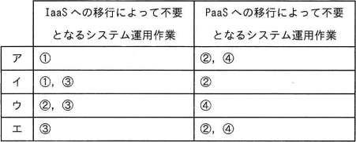
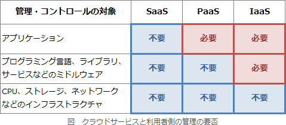

# [令和5年春期 午前 問57](https://www.ap-siken.com/kakomon/05_haru/q57.html)

#問題 #マネジメント #サービスマネジメント

解説を表示解説を隠す

<strong>問57</strong>　A社は，自社がオンプレミスで運用している業務システムを，クラウドサービスへ段階的に移行する。段階的移行では，初めにネットワークとサーバをIaaSに移行し，次に全てのミドルウェアをPaaSに移行する。A社が行っているシステム運用作業のうち，この移行によって不要となる作業の組合せはどれか。  〔A社が行っているシステム運用作業〕 ① 業務システムのバッチ処理のジョブ監視 ② 物理サーバの起動，停止のオペレーション ③ ハードウェアの異常を警告する保守ランプの目視監視 ④ ミドルウェアへのパッチ適用 

<ul class="ap-choices">
<li class="ap-choice-item ap-wrong">

ア

不要となる作業の組合せが誤っています。組合せは選択肢表を参照してください。

</li>
<li class="ap-choice-item ap-wrong">

イ

不要となる作業の組合せが誤っています。組合せは選択肢表を参照してください。

</li>
<li class="ap-choice-item ap-correct">

ウ

正しい。②物理サーバの起動・停止、③ハードウェア監視は<a href="用語/IaaS" class="internal-link" data-href="用語/IaaS">IaaS</a>移行で不要。④<a href="用語/ミドルウェア" class="internal-link" data-href="用語/ミドルウェア">ミドルウェア</a>のパッチ適用は<a href="用語/PaaS" class="internal-link" data-href="用語/PaaS">PaaS</a>移行で不要。①ジョブ監視はアプリケーション運用としてA社が継続します。

</li>
<li class="ap-choice-item ap-wrong">

エ

不要となる作業の組合せが誤っています。組合せは選択肢表を参照してください。

</li>
</ul>

<h4>解説</h4>

<a href="用語/IaaS" class="internal-link" data-href="用語/IaaS">IaaS</a>(Infrastructure as a Service)では、物理サーバやネットワークなどのインフラがサービスとして提供され、それらの維持管理は<a href="用語/サービス提供者" class="internal-link" data-href="用語/サービス提供者">サービス提供者</a>が行います。<a href="用語/PaaS" class="internal-link" data-href="用語/PaaS">PaaS</a>(Platform as a Service)では、アプリケーションを開発し、稼働するための環境がサービスとして提供され、それらの維持管理は<a href="用語/サービス提供者" class="internal-link" data-href="用語/サービス提供者">サービス提供者</a>が行います。

①アプリケーションの運用はA社で行います。②物理サーバの起動・停止は、<a href="用語/IaaS" class="internal-link" data-href="用語/IaaS">IaaS</a>の業者が行うので不要となります。③ハードウェア監視も、<a href="用語/IaaS" class="internal-link" data-href="用語/IaaS">IaaS</a>の業者が行うので不要となります。④<a href="用語/ミドルウェア" class="internal-link" data-href="用語/ミドルウェア">ミドルウェア</a>のパッチ適用は、<a href="用語/PaaS" class="internal-link" data-href="用語/PaaS">PaaS</a>の業者が行うので不要となります。したがって「ウ」の組合せが適切です。

