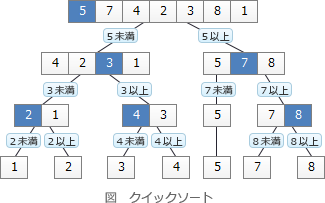

# [令和5年春期 午前 問7](https://www.ap-siken.com/kakomon/05_haru/q7.html)

#問題 #テクノロジ #アルゴリズムとプログラミング #アルゴリズム

解説を表示解説を隠す

<strong>問7</strong>　配列に格納されたデータ2，3，5，4，1に対して，クイックソートを用いて昇順に並べ替える。2回目の分割が終わった状態はどれか。ここで，分割は基準値より小さい値と大きい値のグループに分けるものとする。また，分割のたびに基準値はグループ内の配列の左端の値とし，グループ内の配列の値の順番は元の配列と同じとする。

<ul class="ap-choices">
<li class="ap-choice-item ap-correct">

ア　1，2，3，5，4

正しい。1回目の分割後は[1]，[2]，[3，5，4]となり、2回目では[3，5，4]を基準値3で分割して[3]，[5，4]となる。

</li>
<li class="ap-choice-item ap-wrong">

イ　1，2，5，4，3

2回目の分割後の状態ではない。右側グループ[3，5，4]の分割結果の並びが異なる。

</li>
<li class="ap-choice-item ap-wrong">

ウ　2，3，1，4，5

2回目の分割後の状態ではない。1回目の分割後の<a href="用語/配列" class="internal-link" data-href="用語/配列">配列</a>[1，2，3，5，4]とも一致しない。

</li>
<li class="ap-choice-item ap-wrong">

エ　2，3，4，5，1

2回目の分割後の状態ではない。1回目の分割後の<a href="用語/配列" class="internal-link" data-href="用語/配列">配列</a>[1，2，3，5，4]とも一致しない。

</li>
</ul>

<h4>解説</h4>

<a href="用語/クイックソート" class="internal-link" data-href="用語/クイックソート">クイックソート</a>は、整列対象のデータ群をある基準値以下のグループと基準値以上のグループに分割し、さらに分割後の各グループで基準値を選んで二つのグループに分割するという処理を繰り返してデータを整列する<a href="用語/アルゴリズム" class="internal-link" data-href="用語/アルゴリズム">アルゴリズム</a>です。下図のように全体を小集団に分けながら整列を行うので、分割統治型の整列<a href="用語/アルゴリズム" class="internal-link" data-href="用語/アルゴリズム">アルゴリズム</a>と言えます。

①<a href="用語/配列" class="internal-link" data-href="用語/配列">配列</a>の左端の値を基準値とする、②分割は基準値よりも小さい値と大きい値に分ける、という条件に従って分割を進めていくと次のようになります。

[2，3，5，4，1]左端の2より小さいグループ、大きいグループに分ける（1回目の分割） [1]，[2]，[3，5，4]各グループで左端の値を基準に小さいグループ、大きいグループに分ける（2回目の分割） [1]，[2]，[3]，[5，4] したがって、2回目分割後の<a href="用語/配列" class="internal-link" data-href="用語/配列">配列</a>の状態は「1，2，3，5，4」です。

