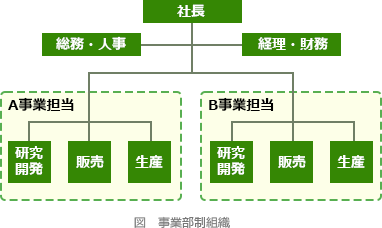

# [令和5年春期 午前 問74](https://www.ap-siken.com/kakomon/05_haru/q74.html)

#問題 #ストラテジ #企業活動 #経営・組織論

解説を表示解説を隠す

<strong>問74</strong>　事業部制組織の特徴を説明したものはどれか。

<ul class="ap-choices">
<li class="ap-choice-item ap-wrong">

ア　ある問題を解決するために一定の期間に限って結成され，問題解決とともに解散する。

<a href="用語/プロジェクト組織" class="internal-link" data-href="用語/プロジェクト組織">プロジェクト組織</a>の説明です。

</li>
<li class="ap-choice-item ap-wrong">

イ　業務を機能別に分け，各機能について部下に命令，指導を行う。

<a href="用語/職能別組織" class="internal-link" data-href="用語/職能別組織">職能別組織</a>の説明です。

</li>
<li class="ap-choice-item ap-correct">

ウ　製品，地域などで構成された組織単位に，利益責任をもたせる。

正しい。<a href="用語/事業部制組織" class="internal-link" data-href="用語/事業部制組織">事業部制組織</a>の説明です。

</li>
<li class="ap-choice-item ap-wrong">

エ　戦略的提携や共同開発など外部の経営資源を積極的に活用することによって，経営環境に対応していく。

<a href="用語/アライアンス" class="internal-link" data-href="用語/アライアンス">アライアンス</a>の説明です。

</li>
</ul>

<h4>解説</h4>

<a href="用語/事業部制組織" class="internal-link" data-href="用語/事業部制組織">事業部制組織</a>は、トップマネジメントの下に、製品別・商品別・地域別・市場別などの単位で事業部を設け、それぞれの事業部が一定の権限をもって意思決定を行う組織形態です。各事業部が収益と費用に責任をもつ独立採算制をとることが特徴です。

<a href="用語/事業部制組織" class="internal-link" data-href="用語/事業部制組織">事業部制組織</a>では、事業部ごとに営業・生産・総務・管理などの職能組織が置かれます。事業ごとに独立した組織体制をとることで、それぞれの<a href="用語/市場ニーズ" class="internal-link" data-href="用語/市場ニーズ">市場ニーズ</a>に対応しやすくなります。例えば、自動車製造会社が乗用車部門、トラック部門、バス部門を設ける場合や、家電メーカーがエアコン部門、テレビ部門、冷蔵庫部門を設ける場合などが、これに該当します。

