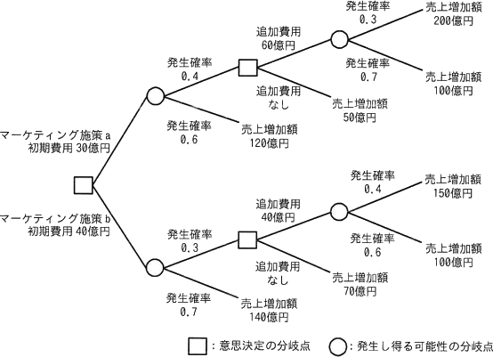
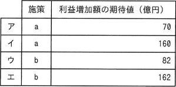
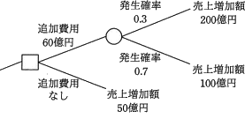
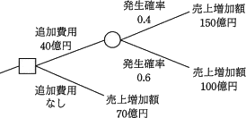
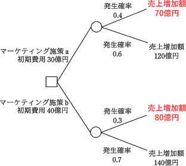

# [令和5年春期 午前 問75](https://www.ap-siken.com/kakomon/05_haru/q75.html)

#問題 #ストラテジ #企業活動 #業務分析・データ利活用

解説を表示解説を隠す

<strong>問75</strong>　ビッグデータ分析の手法の一つであるデシジョンツリーを活用してマーケティング施策の判断に必要な事象を整理し，発生確率の精度を向上させた上で二つのマーケティング施策a，bの選択を行う。マーケティング施策を実行した場合の利益増加額(売上増加額－費用)の期待値が最大となる施策と，そのときの利益増加額の期待値の組合せはどれか。  

<ul class="ap-choices">
<li class="ap-choice-item ap-wrong">

ア

マーケティング施策と利益増加額の期待値の組合せが誤っています。組合せは選択肢表を参照してください。

</li>
<li class="ap-choice-item ap-wrong">

イ

マーケティング施策と利益増加額の期待値の組合せが誤っています。組合せは選択肢表を参照してください。

</li>
<li class="ap-choice-item ap-correct">

ウ

正しい。期待値が最大となるのはマーケティング施策b（利益増加額の期待値は82億円）。

</li>
<li class="ap-choice-item ap-wrong">

エ

マーケティング施策と利益増加額の期待値の組合せが誤っています。組合せは選択肢表を参照してください。

</li>
</ul>

<h4>解説</h4>

最初に、<a href="用語/デシジョンツリー" class="internal-link" data-href="用語/デシジョンツリー">デシジョンツリー</a>の途中にある意思決定の分岐点("□"部分)で「追加費用を払うべきか否か」を決定してから、マーケティング施策を選ぶという2段階で計算します。

まず、マーケティング施策aの先にある下記の部分木に注目します。そして追加費用の良し悪しを得られる利益の期待値をもとに判断します。

[追加費用60億円] 　200億円×0.3＋100億円×0.7－60億円 ＝60＋70－60＝70億円

[追加費用なし] 　50億円

以上より、追加費用を払った方が得られる利益は高くなることがわかります。したがって、マーケティング施策aにおいて発生確率0.4の事象に推移した場合は、「追加費用を払う」を選択すべきであり、その際の利益の期待値は70億円であると決定します。

同様に、マーケティング施策bの先にある下記の部分木に注目し、先程と同じ手順で意思決定します。

[追加費用40億円] 　150億円×0.4＋100億円×0.6－40億円 ＝60＋60－40＝80億円

[追加費用なし] 　70億円

以上より、追加費用を払った方が得られる利益は高くなることがわかります。したがって、マーケティング施策bにおいて発生確率0.3の事象に推移した場合は、「追加費用を払う」を選択すべきであり、その際の利益の期待値は80億円であると決定します。

最後にマーケティング施策ごとの利益の期待値を算出し、期待値が多い施策を選択します。

[マーケティング施策a] 　70億円×0.4＋120億円×0.6－30億円 ＝28＋72－30＝70億円

[マーケティング施策b] 　80億円×0.3＋140億円×0.7－40億円 ＝24＋98－40＝82億円

したがって、期待値が最大となる施策はb、利益増加額の期待値は82億円となる「ウ」の組合せが適切です。

