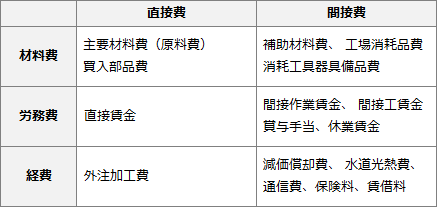

# [令和5年春期 午前 問76](https://www.ap-siken.com/kakomon/05_haru/q76.html)

#問題 #ストラテジ #企業活動 #会計・財務

解説を表示解説を隠す

<strong>問76</strong>　原価計算基準に従い製造原価の経費に算入する費用はどれか。

<ul class="ap-choices">
<li class="ap-choice-item ap-correct">

ア　製品を生産している機械装置の修繕費用

正しい。機械装置の修繕費は、間接経費として製造原価に算入します。

</li>
<li class="ap-choice-item ap-wrong">

イ　台風で被害を受けた製品倉庫の修繕費用

火災、震災、風水害、盗難、争議等の偶発的事故などの異常な状態を原因とする損失は、非原価項目に該当します。

</li>
<li class="ap-choice-item ap-wrong">

ウ　賃貸目的で購入した倉庫の管理費用

賃貸目的など投資資産と認められる不動産、有価証券、貸付金等に関する<a href="用語/減価償却" class="internal-link" data-href="用語/減価償却">減価償却</a>費、管理費、租税等の費用は、非原価項目に該当します。

</li>
<li class="ap-choice-item ap-wrong">

エ　本社社屋建設のために借り入れた資金の支払利息

支払利息や割引料などの財務活動に関する費用は、非原価項目に該当します。

</li>
</ul>

<h4>解説</h4>

<strong>製造原価</strong>は、製品の生産、販売に関して消費された経済価値の総和です。直接的・間接的を問わず、製品を作り出すために支出されたあらゆる費用を含みますが、以下の2つについては製造原価に算入しないのが原則です。

<ul>
<li>製品の生産、販売に関連しない活動、例えば財務活動に関する費用</li>
<li>異常な状態を原因とする価値の減少</li>
</ul>

製造原価の費目別計算においては、材料費、労務費および経費の分類を基本とし、これを<a href="用語/直接費" class="internal-link" data-href="用語/直接費">直接費</a>と<a href="用語/間接費" class="internal-link" data-href="用語/間接費">間接費</a>とに分けます。<a href="用語/原価計算" class="internal-link" data-href="用語/原価計算">原価計算</a>基準(1962年-企業会計審議会)では6つのカテゴリの分類例として以下の費目を挙げています。

