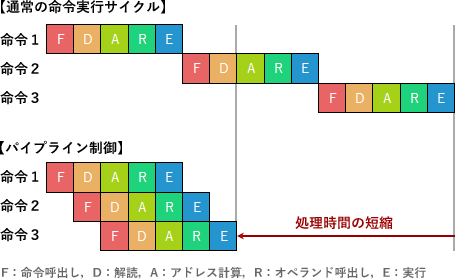
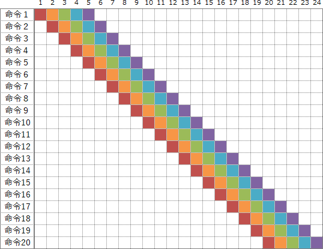

# [令和5年春期 午前 問9](https://www.ap-siken.com/kakomon/05_haru/q9.html)

#問題 #テクノロジ #コンピュータ構成要素 #プロセッサ

解説を表示解説を隠す

<strong>問9</strong>　全ての命令が5ステージで完了するように設計された，パイプライン制御のCPUがある。20命令を実行するには何サイクル必要となるか。ここで，全ての命令は途中で停止することなく実行でき，パイプラインの各ステージは1サイクルで動作を完了するものとする。

<ul class="ap-choices">
<li class="ap-choice-item ap-wrong">

ア　20

パイプラインの深さ分の起動オーバーヘッドを考慮していない。

</li>
<li class="ap-choice-item ap-wrong">

イ　21

(20＋5－1)＝24ではない値。

</li>
<li class="ap-choice-item ap-correct">

ウ　24

正しい。(20＋5－1)×1＝24サイクル。

</li>
<li class="ap-choice-item ap-wrong">

エ　25

深さ5のパイプラインで20命令のときは24サイクル。

</li>
</ul>

<h4>解説</h4>

パイプライン制御は、<a href="用語/CPU" class="internal-link" data-href="用語/CPU">CPU</a>が実行する命令を、命令読出し(<a href="用語/フェッチ" class="internal-link" data-href="用語/フェッチ">フェッチ</a>)、解読(デコード)、<a href="用語/アドレス計算" class="internal-link" data-href="用語/アドレス計算">アドレス計算</a>、オペランド呼出し、実行 というような複数のステージに分け、各ステージを少しずつずらしつつ独立した処理機構で並列に実行することで、処理時間全体を短縮させる<a href="用語/CPU" class="internal-link" data-href="用語/CPU">CPU</a>の高速化技法です。設問には5ステージとあるので、1命令が5つのステージに分割されているとわかります。下図のようにそれぞれのサイクルは並列実行されるため、20命令を実行するのに必要なサイクル数は24サイクルとなります。

また、パイプラインの処理時間を求める公式(I＋D－1)×Pを用いても計算することができます。

パイプラインの処理時間を求める公式(I＋D－1)×P I：命令数 D：パイプラインの深さ（命令の分割数） P：パイプラインのピッチ（各ステージの実行時間）

本問だと、命令数(I)が20、パイプラインの深さ(D)が5、パイプラインのピッチが1サイクルなので、 (20＋5－1)×1＝24サイクル したがって「ウ」が正解です。

