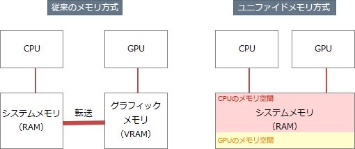

# [令和5年秋期 午前 問11](https://www.ap-siken.com/kakomon/05_aki/q11.html)

#問題 #テクノロジ #コンピュータ構成要素 #メモリ

解説を表示解説を隠す

<strong>問11</strong>　画面表示用フレームバッファがユニファイドメモリ方式であるシステムの特徴はどれか。

<ul class="ap-choices">
<li class="ap-choice-item ap-wrong">

ア　主記憶とは別に専用のフレームバッファをもつ。

ユニファイド<a href="用語/メモリ" class="internal-link" data-href="用語/メモリ">メモリ</a>方式では、フレームバッファは<a href="用語/主記憶" class="internal-link" data-href="用語/主記憶">主記憶</a>の中にもちます。専用の表示用<a href="用語/メモリ" class="internal-link" data-href="用語/メモリ">メモリ</a>を別途もつ方式とは異なります。

</li>
<li class="ap-choice-item ap-correct">

イ　主記憶の一部を表示領域として使用する。

正しい。ユニファイド<a href="用語/メモリ" class="internal-link" data-href="用語/メモリ">メモリ</a>方式では、システム<a href="用語/メモリ" class="internal-link" data-href="用語/メモリ">メモリ</a>とグラフィックス<a href="用語/メモリ" class="internal-link" data-href="用語/メモリ">メモリ</a>（VRAM）が統合されているため、<a href="用語/GPU" class="internal-link" data-href="用語/GPU">GPU</a>にVRAMは搭載されません。<a href="用語/GPU" class="internal-link" data-href="用語/GPU">GPU</a>は<a href="用語/主記憶" class="internal-link" data-href="用語/主記憶">主記憶</a>の一部を表示領域として使用します。

</li>
<li class="ap-choice-item ap-wrong">

ウ　シリアル接続した表示デバイスに，描画コマンドを用いて表示する。

ユニファイド<a href="用語/メモリ" class="internal-link" data-href="用語/メモリ">メモリ</a>方式とは無関係です。

</li>
<li class="ap-choice-item ap-wrong">

エ　表示リフレッシュが不要である。

ユニファイド<a href="用語/メモリ" class="internal-link" data-href="用語/メモリ">メモリ</a>方式とは無関係です。<a href="用語/液晶ディスプレイ" class="internal-link" data-href="用語/液晶ディスプレイ">液晶ディスプレイ</a>/有機EL/CRTは、基本的に一定周期で画面を走査・更新する<a href="用語/リフレッシュ" class="internal-link" data-href="用語/リフレッシュ">リフレッシュ</a>処理が必要です。

</li>
</ul>

<h4>解説</h4>

ユニファイド<a href="用語/メモリ" class="internal-link" data-href="用語/メモリ">メモリ</a>方式は、<a href="用語/CPU" class="internal-link" data-href="用語/CPU">CPU</a>と<a href="用語/GPU" class="internal-link" data-href="用語/GPU">GPU</a>で一つの<a href="用語/主記憶" class="internal-link" data-href="用語/主記憶">主記憶</a>を共有して使う方式です。通常の<a href="用語/メモリ" class="internal-link" data-href="用語/メモリ">メモリ</a>方式では、<a href="用語/CPU" class="internal-link" data-href="用語/CPU">CPU</a>はメイン<a href="用語/メモリ" class="internal-link" data-href="用語/メモリ">メモリ</a>、<a href="用語/GPU" class="internal-link" data-href="用語/GPU">GPU</a>はVRAMと、別々の<a href="用語/メモリ" class="internal-link" data-href="用語/メモリ">メモリ</a>を使います。このため、<a href="用語/GPU" class="internal-link" data-href="用語/GPU">GPU</a>のVRAMが<a href="用語/主記憶" class="internal-link" data-href="用語/主記憶">主記憶</a>のデータを使いたいときなど、相手のプロセッサのデータを読むには自分の<a href="用語/メモリ" class="internal-link" data-href="用語/メモリ">メモリ</a>空間にコピーする手間が発生し、このオーバーヘッドが<a href="用語/性能" class="internal-link" data-href="用語/性能">性能</a>低下を招きます。ユニファイド<a href="用語/メモリ" class="internal-link" data-href="用語/メモリ">メモリ</a>方式では単一の<a href="用語/メモリ" class="internal-link" data-href="用語/メモリ">メモリ</a>空間をとるため、余分なデータ転送を減らすことができ、<a href="用語/パフォーマンス" class="internal-link" data-href="用語/パフォーマンス">パフォーマンス</a>が向上します。

