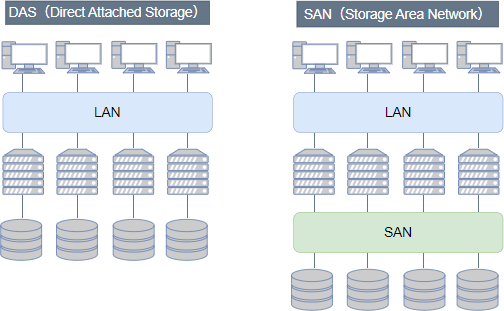

# [令和5年秋期 午前 問12](https://www.ap-siken.com/kakomon/05_aki/q12.html)

#問題 #テクノロジ #システム構成要素 #システムの構成

解説を表示解説を隠す

<strong>問12</strong>　SAN(Storage Area Network)におけるサーバとストレージの接続形態の説明として，適切なものはどれか。

<ul class="ap-choices">
<li class="ap-choice-item ap-wrong">

ア　シリアルATAなどの接続方式によって内蔵ストレージとして1対1に接続する。

これはDAS(Direct Attached Storage)の接続形態です。<a href="用語/シリアルATA" class="internal-link" data-href="用語/シリアルATA">シリアルATA</a>は筐体内の内蔵ストレージと接続する規格であり、<a href="用語/SAN" class="internal-link" data-href="用語/SAN">SAN</a>の1対多接続とは異なります。

</li>
<li class="ap-choice-item ap-correct">

イ　ファイバチャネルなどによる専用ネットワークで接続する。

正しい。<a href="用語/SAN" class="internal-link" data-href="用語/SAN">SAN</a>では<a href="用語/サーバ" class="internal-link" data-href="用語/サーバ">サーバ</a>はストレージ専用のネットワークと接続します。

</li>
<li class="ap-choice-item ap-wrong">

ウ　プロトコルはCIFS(Common Internet File System)を使用し，LANで接続する。

これは<a href="用語/NAS" class="internal-link" data-href="用語/NAS">NAS</a>(Network Attached Storage)の接続形態です。CIFSは<a href="用語/NAS" class="internal-link" data-href="用語/NAS">NAS</a>で使用されるWindows OS用のファイル共有プロトコルであり、<a href="用語/SAN" class="internal-link" data-href="用語/SAN">SAN</a>は<a href="用語/LAN" class="internal-link" data-href="用語/LAN">LAN</a>とは別に構築されます。

</li>
<li class="ap-choice-item ap-wrong">

エ　プロトコルはNFS(Network File System)を使用し，LANで接続する。

これは<a href="用語/NAS" class="internal-link" data-href="用語/NAS">NAS</a>の接続形態です。<a href="用語/NFS" class="internal-link" data-href="用語/NFS">NFS</a>は<a href="用語/NAS" class="internal-link" data-href="用語/NAS">NAS</a>で使用されるLinuxなどUNIX系用ファイル共有プロトコルであり、<a href="用語/SAN" class="internal-link" data-href="用語/SAN">SAN</a>は<a href="用語/LAN" class="internal-link" data-href="用語/LAN">LAN</a>とは別に構築されます。

</li>
</ul>

<h4>解説</h4>

<a href="用語/SAN" class="internal-link" data-href="用語/SAN">SAN</a>(Storage Area Network)は、個々の<a href="用語/サーバ" class="internal-link" data-href="用語/サーバ">サーバ</a>にストレージを直接接続するのではなく、<a href="用語/LAN" class="internal-link" data-href="用語/LAN">LAN</a>とは別に<a href="用語/サーバ" class="internal-link" data-href="用語/サーバ">サーバ</a>群の後方にストレージ専用のネットワークを構築し、そこにストレージ群を統合する技術です。

<a href="用語/SAN" class="internal-link" data-href="用語/SAN">SAN</a>には、ファイバーチャネルネットワークで構築するFC-SANと、<a href="用語/TCP/IP" class="internal-link" data-href="用語/TCP/IP">TCP/IP</a>ネットワークで構築するIP-SANの2種類があります。<a href="用語/サーバ" class="internal-link" data-href="用語/サーバ">サーバ</a>と<a href="用語/SAN" class="internal-link" data-href="用語/SAN">SAN</a>の接続は、光ファイバーを伝送媒体とするFCP(Fibre Channel Protocol)やiSCSI(Internet SCSI)プロトコルによって行われるので、<a href="用語/LAN" class="internal-link" data-href="用語/LAN">LAN</a>よりも高速な転送が可能です。また、ストレージが<a href="用語/サーバ" class="internal-link" data-href="用語/サーバ">サーバ</a>から独立するので、<a href="用語/スケールアウト" class="internal-link" data-href="用語/スケールアウト">スケールアウト</a>や<a href="用語/運用管理" class="internal-link" data-href="用語/運用管理">運用管理</a>も効率的に行えるようになります。

