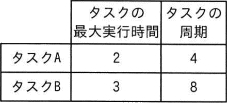
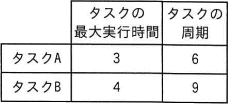
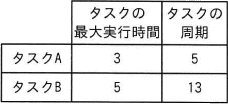
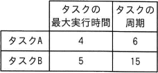
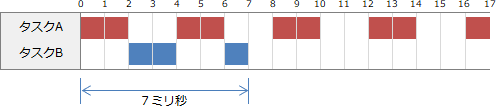
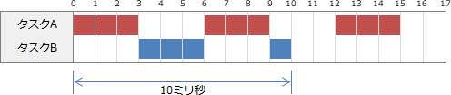
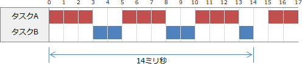
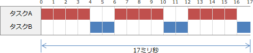

# [令和5年秋期 午前 問17](https://www.ap-siken.com/kakomon/05_aki/q17.html)

#問題 #テクノロジ #ソフトウェア #オペレーティングシステム

解説を表示解説を隠す

<strong>問17</strong>　プリエンプティブな優先度ベースのスケジューリングで実行する二つの周期タスクA及びBがある。タスクBが周期内に処理を完了できるタスクA及びBの最大実行時間及び周期の組合せはどれか。ここで，タスクAの方がタスクBより優先度が高く，かつ，タスクAとBの共有資源はなく，タスク切替え時間は考慮しないものとする。また，時間及び周期の単位はミリ秒とする。

<ul class="ap-choices">
<li class="ap-choice-item ap-correct">

ア　

正しい。<a href="用語/タスク" class="internal-link" data-href="用語/タスク">タスク</a>Aの隙間で<a href="用語/タスク" class="internal-link" data-href="用語/タスク">タスク</a>Bを実行していくと、7ミリ秒で<a href="用語/タスク" class="internal-link" data-href="用語/タスク">タスク</a>Bを完了できます。よって、8ミリ秒の周期内で完了できます。

</li>
<li class="ap-choice-item ap-wrong">

イ　

<a href="用語/タスク" class="internal-link" data-href="用語/タスク">タスク</a>Bの4ミリ秒の処理を完了するのに10ミリ秒を要します。よって、9ミリ秒の周期に収まりません。

</li>
<li class="ap-choice-item ap-wrong">

ウ　

<a href="用語/タスク" class="internal-link" data-href="用語/タスク">タスク</a>Bの5ミリ秒の処理を完了するのに14ミリ秒を要します。よって、13ミリ秒の周期に収まりません。

</li>
<li class="ap-choice-item ap-wrong">

エ　

<a href="用語/タスク" class="internal-link" data-href="用語/タスク">タスク</a>Bの5ミリ秒の処理を完了するのに17ミリ秒を要します。よって、15ミリ秒の周期に収まりません。

</li>
</ul>

<h4>解説</h4>

<a href="用語/優先度" class="internal-link" data-href="用語/優先度">優先度</a>ベースの<a href="用語/スケジューリング" class="internal-link" data-href="用語/スケジューリング">スケジューリング</a>であり、<a href="用語/優先度" class="internal-link" data-href="用語/優先度">優先度</a>は<a href="用語/タスク" class="internal-link" data-href="用語/タスク">タスク</a>Aが<a href="用語/タスク" class="internal-link" data-href="用語/タスク">タスク</a>Bよりも高いので、<a href="用語/タスク" class="internal-link" data-href="用語/タスク">タスク</a>Bの処理は、<a href="用語/タスク" class="internal-link" data-href="用語/タスク">タスク</a>Aの処理が進行していない時間に挿入されることになります。図を描いてみるとわかりやすいです。

正しい。<a href="用語/タスク" class="internal-link" data-href="用語/タスク">タスク</a>Aの隙間で<a href="用語/タスク" class="internal-link" data-href="用語/タスク">タスク</a>Bを実行していくと、7ミリ秒で<a href="用語/タスク" class="internal-link" data-href="用語/タスク">タスク</a>Bを完了できます。よって、8ミリ秒の周期内で完了できます。 

<a href="用語/タスク" class="internal-link" data-href="用語/タスク">タスク</a>Bの4ミリ秒の処理を完了するのに10ミリ秒を要します。よって、9ミリ秒の周期に収まりません。 

<a href="用語/タスク" class="internal-link" data-href="用語/タスク">タスク</a>Bの5ミリ秒の処理を完了するのに14ミリ秒を要します。よって、13ミリ秒の周期に収まりません。 

<a href="用語/タスク" class="internal-link" data-href="用語/タスク">タスク</a>Bの5ミリ秒の処理を完了するのに17ミリ秒を要します。よって、15ミリ秒の周期に収まりません。 

