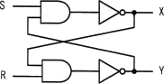
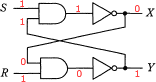
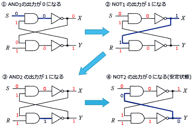
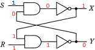

# [令和5年秋期 午前 問22](https://www.ap-siken.com/kakomon/05_aki/q22.html)

#問題 #テクノロジ #ハードウェア #ハードウェア

解説を表示解説を隠す

<strong>問22</strong>　図の論理回路において，S=1，R=1，X=0，Y=1のとき，Sを一旦0にした後，再び1に戻した。この操作を行った後のX，Yの値はどれか。 

<ul class="ap-choices">
<li class="ap-choice-item ap-wrong">

ア　X＝0，Y＝0

Sを1に戻した後の安定状態ではない。

</li>
<li class="ap-choice-item ap-wrong">

イ　X＝0，Y＝1

Sを0にする操作前の初期状態であり、操作後の値ではない。

</li>
<li class="ap-choice-item ap-correct">

ウ　X＝1，Y＝0

正しい。<a href="用語/フリップフロップ" class="internal-link" data-href="用語/フリップフロップ">フリップフロップ</a>がS=1に戻ったあと安定する出力の組合せ。

</li>
<li class="ap-choice-item ap-wrong">

エ　X＝1，Y＝1

XとYがともに1になる状態は、この操作後の安定状態ではない。

</li>
</ul>

<h4>解説</h4>

図の論理回路図は<a href="用語/フリップフロップ" class="internal-link" data-href="用語/フリップフロップ">フリップフロップ</a>と呼ばれ、2つの回路の安定した状態によって1<a href="用語/ビット" class="internal-link" data-href="用語/ビット">ビット</a>の情報を保持する回路です。現在と異なる入力が与えられると、次の入力があるまでその状態を保持しようとします。

問題文の初期状態"S=1、R=1、X=0、Y=1"だと、回路は次のようになっています。次にSを0に変えると、次のような状態になります。他方の出力がもう一方の入力に影響を与えるので、2つの回路が安定するまで何回か入出力を繰り返します。そしてSを1に戻すと次のような状態になります。回路はこの状態で安定するので、出力の値は「X＝1，Y＝0」となります。

