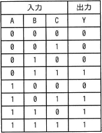
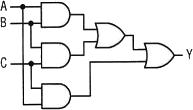
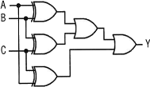
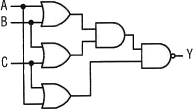
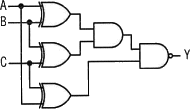
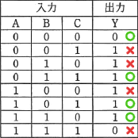
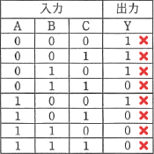
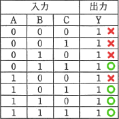

# [令和5年秋期 午前 問23](https://www.ap-siken.com/kakomon/05_aki/q23.html)

#問題 #テクノロジ #ハードウェア

解説を表示解説を隠す

<strong>問23</strong>　真理値表に示す3入力多数決回路はどれか。 

<ul class="ap-choices">
<li class="ap-choice-item ap-correct">

ア　

正しい。

</li>
<li class="ap-choice-item ap-wrong">

イ　

この回路図の<a href="用語/真理値表" class="internal-link" data-href="用語/真理値表">真理値表</a>は問題文の表と一致しないため誤りです。

</li>
<li class="ap-choice-item ap-wrong">

ウ　

この回路図の<a href="用語/真理値表" class="internal-link" data-href="用語/真理値表">真理値表</a>は問題文の表と一致しないため誤りです。

</li>
<li class="ap-choice-item ap-wrong">

エ　

この回路図の<a href="用語/真理値表" class="internal-link" data-href="用語/真理値表">真理値表</a>は問題文の表と一致しないため誤りです。

</li>
</ul>

<h4>解説</h4>

3入力多数決回路なので、<a href="用語/真理値表" class="internal-link" data-href="用語/真理値表">真理値表</a>にあるように3つの入力中2つ以上が"1"（＝"1"が多数）であれば結果に"1"を出力、そして2つ以上が"0"（＝"0"が多数）であれば結果に"0"を出力するものになっている必要があります。

回路ごとにA、B、Cの値を与えた場合の出力を照合していくと、正しいのは「ア」の回路とわかります。

「ア」の回路は、論理的には次のような演算を行う回路と考えられます。

<ol>
<li>まず「A，B」「A，C」「B，C」それぞれの<a href="用語/論理積" class="internal-link" data-href="用語/論理積">論理積</a>を求める。</li>
<li>3つの<a href="用語/論理積" class="internal-link" data-href="用語/論理積">論理積</a>演算の結果に"1"が現れれば、3つの入力中に"1"が2つ以上あることが確定する。逆に"1"が現れなければ3つの入力中の"1"の個数は1以下ということになる。</li>
<li>3つの<a href="用語/論理積" class="internal-link" data-href="用語/論理積">論理積</a>演算の結果の中に少なくとも"1"が1つ以上ある場合には"1"(可決)、そうでなければ"0"(否決)を出力すればよいので、3つの演算結果を<a href="用語/論理和" class="internal-link" data-href="用語/論理和">論理和</a>演算した結果を最終的な出力とする。</li>
</ol>

正しい。

この回路図は<a href="用語/真理値表" class="internal-link" data-href="用語/真理値表">真理値表</a>は以下のようになるため誤りです。 

この回路図は<a href="用語/真理値表" class="internal-link" data-href="用語/真理値表">真理値表</a>は以下のようになるため誤りです。 

この回路図は<a href="用語/真理値表" class="internal-link" data-href="用語/真理値表">真理値表</a>は以下のようになるため誤りです。 

