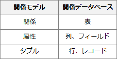
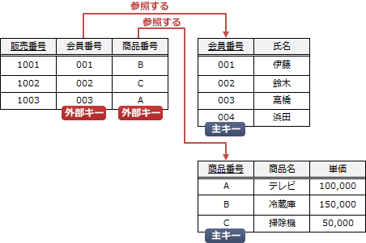

# [令和5年秋期 午前 問27](https://www.ap-siken.com/kakomon/05_aki/q27.html)

#問題 #テクノロジ #データベース #データベース設計

解説を表示解説を隠す

<strong>問27</strong>　関係モデルにおける外部キーの説明として，適切なものはどれか。

<ul class="ap-choices">
<li class="ap-choice-item ap-correct">

ア　ある関係の候補キーを参照する属性，又は属性の組

正しい。<a href="用語/外部キー" class="internal-link" data-href="用語/外部キー">外部キー</a>の説明です。

</li>
<li class="ap-choice-item ap-wrong">

イ　主キー以外で，タプルを一意に識別できる属性，又は属性の組

代理キー(alternate key)の説明です。例えば、従業員表に<a href="用語/属性" class="internal-link" data-href="用語/属性">属性</a>"社員番号"と<a href="用語/属性" class="internal-link" data-href="用語/属性">属性</a>"運転免許証番号"がある場合、どちらも行を一意に識別できるため<a href="用語/主キー" class="internal-link" data-href="用語/主キー">主キー</a>にすることができます。このような場合、"社員番号"を<a href="用語/主キー" class="internal-link" data-href="用語/主キー">主キー</a>にすると"運転免許証番号"が代理キーとなります。逆もまたしかりです。

</li>
<li class="ap-choice-item ap-wrong">

ウ　タプルを一意に識別できる属性，又は属性の組の集合のうち極小のもの

候補キー(candidate key)の説明です。<a href="用語/主キー" class="internal-link" data-href="用語/主キー">主キー</a>の候補となる<a href="用語/属性" class="internal-link" data-href="用語/属性">属性</a>または<a href="用語/属性" class="internal-link" data-href="用語/属性">属性</a>の組なので、候補キーと呼ばれます。例えば、(社員番号，氏名，生年月日)という<a href="用語/関係" class="internal-link" data-href="用語/関係">関係</a>がある場合、"社員番号"が候補キーとなります。

</li>
<li class="ap-choice-item ap-wrong">

エ　タプルを一意に識別できる属性，又は属性の組を含む集合

スーパーキー(super key)の説明です。<a href="用語/データベース" class="internal-link" data-href="用語/データベース">データベース</a>内の行を一意に識別できるという点は候補キーと同じですが、"極小"という条件を除いたものです。例えば、(社員番号，氏名，生年月日)という<a href="用語/関係" class="internal-link" data-href="用語/関係">関係</a>がある場合、{社員番号, 氏名}や{社員番号，生年月日}の組は行を一意に識別可能ですが、余分な<a href="用語/属性" class="internal-link" data-href="用語/属性">属性</a>を含んでいる（極小ではない）のでスーパーキーとなります。

</li>
</ul>

<h4>解説</h4>

<a href="用語/関係モデル" class="internal-link" data-href="用語/関係モデル">関係モデル</a>の用語と関係データベースの要素は、次のように対応します。

<a href="用語/関係モデル" class="internal-link" data-href="用語/関係モデル">関係モデル</a>では<a href="用語/正規化" class="internal-link" data-href="用語/正規化">正規化</a>の過程で表を複数に分割しますが、分割の際に2つの表に同じ<a href="用語/属性" class="internal-link" data-href="用語/属性">属性</a>を持たせることで表同士の関連付けを行います。共通する<a href="用語/属性" class="internal-link" data-href="用語/属性">属性</a>のうち、参照される側の<a href="用語/属性" class="internal-link" data-href="用語/属性">属性</a>が<a href="用語/主キー" class="internal-link" data-href="用語/主キー">主キー</a>(primary key)、参照する側の<a href="用語/属性" class="internal-link" data-href="用語/属性">属性</a>が<a href="用語/外部キー" class="internal-link" data-href="用語/外部キー">外部キー</a>(foreign key)となります。<a href="用語/外部キー" class="internal-link" data-href="用語/外部キー">外部キー</a>は、下図のようにある<a href="用語/関係" class="internal-link" data-href="用語/関係">関係</a>の候補キー(<a href="用語/主キー" class="internal-link" data-href="用語/主キー">主キー</a>)を参照する役割を持ちます。

したがって「ア」の説明が適切です。

