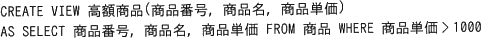

# [令和5年秋期 午前 問28](https://www.ap-siken.com/kakomon/05_aki/q28.html)

#問題 #テクノロジ #データベース #データ操作

解説を表示解説を隠す

<strong>問28</strong>　更新可能なビューを作成するSQL文はどれか。ここで，SQL文中に現れる基底表は全て更新可能とする。

<ul class="ap-choices">
<li class="ap-choice-item ap-correct">

ア　

正しい。上記の構造を含まないので更新可能なビューです。

</li>
<li class="ap-choice-item ap-wrong">

イ　

DISTINCT句が含まれているため更新できません。

</li>
<li class="ap-choice-item ap-wrong">

ウ　

<a href="用語/集約関数" class="internal-link" data-href="用語/集約関数">集約関数</a>SUMおよびGROUP BY句が含まれているため更新できません。

</li>
<li class="ap-choice-item ap-wrong">

エ　

<a href="用語/集約関数" class="internal-link" data-href="用語/集約関数">集約関数</a>AVGが含まれているため更新できません。

</li>
</ul>

<h4>解説</h4>

更新可能なビューとは、<a href="用語/実表" class="internal-link" data-href="用語/実表">実表</a>に対して行を挿入、更新または削除できるビューです。ビューを更新可能とするためには、ビュー定義に次に挙げる構造を含めてはいけません。

<ol>
<li><a href="用語/集約関数" class="internal-link" data-href="用語/集約関数">集約関数</a>（AVG、COUNT、SUM、MIN、MAXなど）</li>
<li>2つ以上の表の結合（更新可能な結合，<a href="用語/和集合" class="internal-link" data-href="用語/和集合">和集合</a>及び列を除く）</li>
<li>GROUP BY、ORDER BY、MODEL、CONNECT BY、START WITH、DISTINCTの各句</li>
<li>SELECT構文のリストに<a href="用語/コレクション" class="internal-link" data-href="用語/コレクション">コレクション</a>式</li>
<li>SELECT構文のリストにある<a href="用語/副問合せ" class="internal-link" data-href="用語/副問合せ">副問合せ</a></li>
<li>WITH READ ONLYが指定された<a href="用語/副問合せ" class="internal-link" data-href="用語/副問合せ">副問合せ</a></li>
</ol>

この条件をもとに選択肢のCREATE VIEW文を評価すると、

ア：正しい。上記の構造を含まないので更新可能なビューです。

イ：DISTINCT句が含まれているため更新できません。

ウ：<a href="用語/集約関数" class="internal-link" data-href="用語/集約関数">集約関数</a>SUMおよびGROUP BY句が含まれているため更新できません。

エ：<a href="用語/集約関数" class="internal-link" data-href="用語/集約関数">集約関数</a>AVGが含まれているため更新できません。

