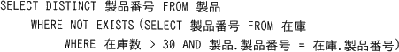
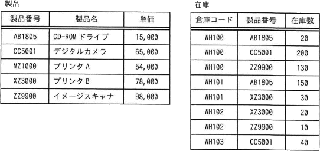
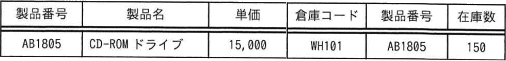
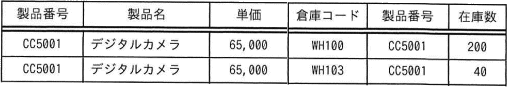
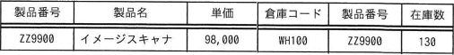
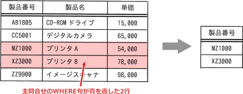

# [令和5年秋期 午前 問29](https://www.ap-siken.com/kakomon/05_aki/q29.html)

#問題 #テクノロジ #データベース #データ操作

解説を表示解説を隠す

<strong>問29</strong>　"製品"表と"在庫"表に対し，次のSQL文を実行した結果として得られる表の行数は幾つか。  

<ul class="ap-choices">
<li class="ap-choice-item ap-wrong">

ア　1

NOT EXISTSが真となる製品番号は2行（MZ1000、XZ3000）なので、結果は1行ではありません。

</li>
<li class="ap-choice-item ap-correct">

イ　2

正しい。在庫数が30より多い行が存在しない製品番号が2行選択されます。

</li>
<li class="ap-choice-item ap-wrong">

ウ　3

NOT EXISTSが真となる製品番号は2行のみです。

</li>
<li class="ap-choice-item ap-wrong">

エ　4

NOT EXISTSが真となる製品番号は2行のみです。

</li>
</ul>

<h4>解説</h4>

<a href="用語/副問合せ" class="internal-link" data-href="用語/副問合せ">副問合せ</a>中に、主問合せの対象となっている製品表の<a href="用語/属性" class="internal-link" data-href="用語/属性">属性</a>（製品番号）が使われているので<a href="用語/相関副問合せ" class="internal-link" data-href="用語/相関副問合せ">相関副問合せ</a>ということになります。<a href="用語/相関副問合せ" class="internal-link" data-href="用語/相関副問合せ">相関副問合せ</a>は、主問合せで処理した行によって<a href="用語/副問合せ" class="internal-link" data-href="用語/副問合せ">副問合せ</a>の内容を変えたいときに使う構文で、主問合せの表の1行ごとにその値を使って<a href="用語/副問合せ" class="internal-link" data-href="用語/副問合せ">副問合せ</a>が実行されます。製品表の行は5つなので、<a href="用語/副問合せ" class="internal-link" data-href="用語/副問合せ">副問合せ</a>も5回行われることになります。

〔1行目　製品番号：AB1805〕 <a href="用語/副問合せ" class="internal-link" data-href="用語/副問合せ">副問合せ</a>では、在庫表から製品番号がAB1805かつ在庫数が30より多い行が選択されるため、<a href="用語/副問合せ" class="internal-link" data-href="用語/副問合せ">副問合せ</a>からは以下の1行が返されます。

NOT EXISTS句は存在しない場合に"真"を返す比較演算子なので、主問合せのWHERE句は1行目に対して"偽"を返します。

〔2行目　製品番号：CC5001〕 1行目と同様に、<a href="用語/副問合せ" class="internal-link" data-href="用語/副問合せ">副問合せ</a>では製品番号がCC5001かつ在庫数が30より多い行が選択されるため、<a href="用語/副問合せ" class="internal-link" data-href="用語/副問合せ">副問合せ</a>からは以下の2行が返されます。

結果セットが存在するため、WHERE句は2行目に対して"偽"を返します。

〔3行目　製品番号：MZ1000〕 <a href="用語/副問合せ" class="internal-link" data-href="用語/副問合せ">副問合せ</a>では製品番号がMZ1000かつ在庫数が30より多い行が抽出されます。しかし、在庫表には製品番号MZ1000の行は存在しないため、<a href="用語/副問合せ" class="internal-link" data-href="用語/副問合せ">副問合せ</a>の結果は<a href="用語/NULL" class="internal-link" data-href="用語/NULL">NULL</a>になります。よって、WHERE句は3行目に対して"真"を返します。

〔4行目　製品番号：XZ3000〕 <a href="用語/副問合せ" class="internal-link" data-href="用語/副問合せ">副問合せ</a>では製品番号がXZ3000かつ在庫数が30より多い行が抽出されます。在庫表には製品番号XZ3000の行が2つありますが、どちらも在庫が30以下のため、<a href="用語/副問合せ" class="internal-link" data-href="用語/副問合せ">副問合せ</a>の結果は<a href="用語/NULL" class="internal-link" data-href="用語/NULL">NULL</a>になります。よって、WHERE句は4行目に対して"真"を返します。

〔5行目　製品番号：ZZ9900〕 <a href="用語/副問合せ" class="internal-link" data-href="用語/副問合せ">副問合せ</a>では製品番号がZZ9900かつ在庫数が30より多い行が選択されるため、<a href="用語/副問合せ" class="internal-link" data-href="用語/副問合せ">副問合せ</a>からは以下の1行が返されます。

結果が存在するため、WHERE句は5行目に対して"偽"を返します。

主問合せのWHERE句が"真"を返した製品番号:MZ1000、XZ3000の2行が選択され、この2行を対象として製品番号列を抜き出すので、結果セットは以下のようになります。したがって、得られる表の行数は2行です。

