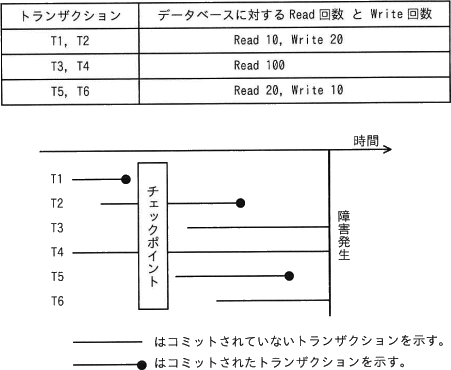
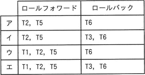
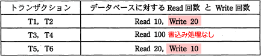

# [令和5年秋期 午前 問30](https://www.ap-siken.com/kakomon/05_aki/q30.html)

#問題 #テクノロジ #データベース #トランザクション処理

解説を表示解説を隠す

<strong>問30</strong>　DBMSをシステム障害発生後に再立上げするとき，ロールフォワードすべきトランザクションとロールバックすべきトランザクションの組合せとして，適切なものはどれか。ここで，トランザクションの中で実行される処理内容は次のとおりとする。  

<ul class="ap-choices">
<li class="ap-choice-item ap-correct">

ア

正しい。<a href="用語/ロールフォワード" class="internal-link" data-href="用語/ロールフォワード">ロールフォワード</a>はT2・T5、<a href="用語/ロールバック" class="internal-link" data-href="用語/ロールバック">ロールバック</a>はT6です。

</li>
<li class="ap-choice-item ap-wrong">

イ

<a href="用語/ロールフォワード" class="internal-link" data-href="用語/ロールフォワード">ロールフォワード</a>と<a href="用語/ロールバック" class="internal-link" data-href="用語/ロールバック">ロールバック</a>の<a href="用語/トランザクション" class="internal-link" data-href="用語/トランザクション">トランザクション</a>の組合せが誤っています。組合せは選択肢表を参照してください。

</li>
<li class="ap-choice-item ap-wrong">

ウ

<a href="用語/ロールフォワード" class="internal-link" data-href="用語/ロールフォワード">ロールフォワード</a>と<a href="用語/ロールバック" class="internal-link" data-href="用語/ロールバック">ロールバック</a>の<a href="用語/トランザクション" class="internal-link" data-href="用語/トランザクション">トランザクション</a>の組合せが誤っています。組合せは選択肢表を参照してください。

</li>
<li class="ap-choice-item ap-wrong">

エ

<a href="用語/ロールフォワード" class="internal-link" data-href="用語/ロールフォワード">ロールフォワード</a>と<a href="用語/ロールバック" class="internal-link" data-href="用語/ロールバック">ロールバック</a>の<a href="用語/トランザクション" class="internal-link" data-href="用語/トランザクション">トランザクション</a>の組合せが誤っています。組合せは選択肢表を参照してください。

</li>
</ul>

<h4>解説</h4>

<a href="用語/トランザクション" class="internal-link" data-href="用語/トランザクション">トランザクション</a>がコミットされると、<a href="用語/DBMS" class="internal-link" data-href="用語/DBMS">DBMS</a>はその更新情報をメモリ上のバッファとログファイルに書き出します。ログファイルについてはディスクへ即時書出しされますが、メモリバッファの内容については入出力効率向上のために、一定の間隔ごとにまとめてディスクに反映する方式をとっています。このディスクと同期を取るタイミングを「<a href="用語/チェックポイント" class="internal-link" data-href="用語/チェックポイント">チェックポイント</a>」といいます。この仕組みにより<a href="用語/チェックポイント" class="internal-link" data-href="用語/チェックポイント">チェックポイント</a>以前にコミットした<a href="用語/トランザクション" class="internal-link" data-href="用語/トランザクション">トランザクション</a>に関してはディスクへの反映が保証されます。

<a href="用語/チェックポイント" class="internal-link" data-href="用語/チェックポイント">チェックポイント</a>法が使用されている<a href="用語/DBMS" class="internal-link" data-href="用語/DBMS">DBMS</a>では、システム<a href="用語/障害" class="internal-link" data-href="用語/障害">障害</a>の発生後、システムを復帰したときは<a href="用語/データベース" class="internal-link" data-href="用語/データベース">データベース</a>が<a href="用語/チェックポイント" class="internal-link" data-href="用語/チェックポイント">チェックポイント</a>の状態に戻っています。このとき、<a href="用語/ロールバック" class="internal-link" data-href="用語/ロールバック">ロールバック</a>とロールフォーワードを組み合わせて、<a href="用語/データベース" class="internal-link" data-href="用語/データベース">データベース</a>を<a href="用語/障害" class="internal-link" data-href="用語/障害">障害</a>発生直前の状態に回復する処理が行われます。

<a href="用語/ロールフォワード" class="internal-link" data-href="用語/ロールフォワード">ロールフォワード</a>（前進復帰）：<a href="用語/障害" class="internal-link" data-href="用語/障害">障害</a>発生前にコミットした<a href="用語/トランザクション" class="internal-link" data-href="用語/トランザクション">トランザクション</a>は、更新後ログを使って、コミットの内容を反映させる

<a href="用語/ロールバック" class="internal-link" data-href="用語/ロールバック">ロールバック</a>（後退復帰）：<a href="用語/障害" class="internal-link" data-href="用語/障害">障害</a>発生時にコミットされていない<a href="用語/トランザクション" class="internal-link" data-href="用語/トランザクション">トランザクション</a>は、更新前ログを使って、<a href="用語/トランザクション" class="internal-link" data-href="用語/トランザクション">トランザクション</a>開始時の状態に戻す

図を見ると、T1は<a href="用語/チェックポイント" class="internal-link" data-href="用語/チェックポイント">チェックポイント</a>前にコミットしているのでリカバリは不要、<a href="用語/チェックポイント" class="internal-link" data-href="用語/チェックポイント">チェックポイント</a>から<a href="用語/障害" class="internal-link" data-href="用語/障害">障害</a>発生までの間にコミットされているT2・T5が<a href="用語/ロールフォワード" class="internal-link" data-href="用語/ロールフォワード">ロールフォワード</a>、<a href="用語/障害" class="internal-link" data-href="用語/障害">障害</a>発生時に<a href="用語/トランザクション" class="internal-link" data-href="用語/トランザクション">トランザクション</a>実行中のT3・T4・T6が<a href="用語/ロールバック" class="internal-link" data-href="用語/ロールバック">ロールバック</a>の対象ということになります。しかし、<a href="用語/トランザクション" class="internal-link" data-href="用語/トランザクション">トランザクション</a>の処理内容を確認すると、T3・T4は<a href="用語/データベース" class="internal-link" data-href="用語/データベース">データベース</a>への書込み処理がありません。書込みが行われない場合、更新前後のデータを記録したログ（<a href="用語/ジャーナルファイル" class="internal-link" data-href="用語/ジャーナルファイル">ジャーナルファイル</a>）が生成されませんから、<a href="用語/チェックポイント" class="internal-link" data-href="用語/チェックポイント">チェックポイント</a>まで戻った後にこれを削除する必要がありません。したがって、T3とT4は<a href="用語/ロールバック" class="internal-link" data-href="用語/ロールバック">ロールバック</a>の対象外となります。

以上のことから、<a href="用語/ロールフォワード" class="internal-link" data-href="用語/ロールフォワード">ロールフォワード</a>で回復するのが「T2，T5」、<a href="用語/ロールバック" class="internal-link" data-href="用語/ロールバック">ロールバック</a>で<a href="用語/トランザクション" class="internal-link" data-href="用語/トランザクション">トランザクション</a>開始前に戻すのが「T6」と判断できます。したがって「ア」が正しい組合せです。

