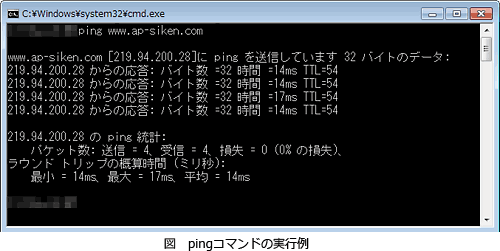

# [令和5年秋期 午前 問33](https://www.ap-siken.com/kakomon/05_aki/q33.html)

#問題 #テクノロジ #ネットワーク #通信プロトコル

解説を表示解説を隠す

<strong>問33</strong>　TCP/IP環境において，pingによってホストの接続確認をするときに使用されるプロトコルはどれか。

<ul class="ap-choices">
<li class="ap-choice-item ap-wrong">

ア　CHAP

Challenge Handshake Authentication Protocolの略。チャレンジレスポンス方式で相手を認証するプロトコルで、<a href="用語/PPP" class="internal-link" data-href="用語/PPP">PPP</a>接続で利用される。<a href="用語/ping" class="internal-link" data-href="用語/ping">ping</a>の疎通確認には使われない。

</li>
<li class="ap-choice-item ap-correct">

イ　ICMP

正しい。<a href="用語/ping" class="internal-link" data-href="用語/ping">ping</a>には<a href="用語/ICMP" class="internal-link" data-href="用語/ICMP">ICMP</a>のメッセージが利用される。<a href="用語/ICMP" class="internal-link" data-href="用語/ICMP">ICMP</a>はIPの通信制御を補完するプロトコルで、<a href="用語/ping" class="internal-link" data-href="用語/ping">ping</a>のほかにもエラー通知などの機能を提供する。

</li>
<li class="ap-choice-item ap-wrong">

ウ　SMTP

Simple Mail Transfer Protocolの略。<a href="用語/TCP/IP" class="internal-link" data-href="用語/TCP/IP">TCP/IP</a>ネットワーク上でメールを転送するためのプロトコルであり、<a href="用語/ping" class="internal-link" data-href="用語/ping">ping</a>の疎通確認には使われない。

</li>
<li class="ap-choice-item ap-wrong">

エ　SNMP

Simple Network Management Protocolの略。<a href="用語/TCP/IP" class="internal-link" data-href="用語/TCP/IP">TCP/IP</a>ネットワーク上で機器の情報を収集し、監視や制御を行うためのプロトコルであり、<a href="用語/ping" class="internal-link" data-href="用語/ping">ping</a>の疎通確認には使われない。

</li>
</ul>

<h4>解説</h4>

<a href="用語/ping" class="internal-link" data-href="用語/ping">ping</a>(ピン／ピング)は、ネットワーク診断のためによく使用されるツールで、ネットワーク内のノードに対して疎通確認を行うものです。

<a href="用語/ping" class="internal-link" data-href="用語/ping">ping</a>には、<a href="用語/ICMP" class="internal-link" data-href="用語/ICMP">ICMP</a>(Internet Control Message Protocol)のメッセージが利用されていて、<a href="用語/ICMP" class="internal-link" data-href="用語/ICMP">ICMP</a>の"echo request"メッセージを対象ノードに送信し、対象ノードが"echo reply"メッセージで応答するというシンプルな仕組みで実装されています。<a href="用語/ping" class="internal-link" data-href="用語/ping">ping</a>を実行することより、対象ノードが存在しているか、対象ノードが正常に稼働しているか、対象ノードまでのネットワークは正常か、などを確認することができます。

したがって「イ」が正解です。

